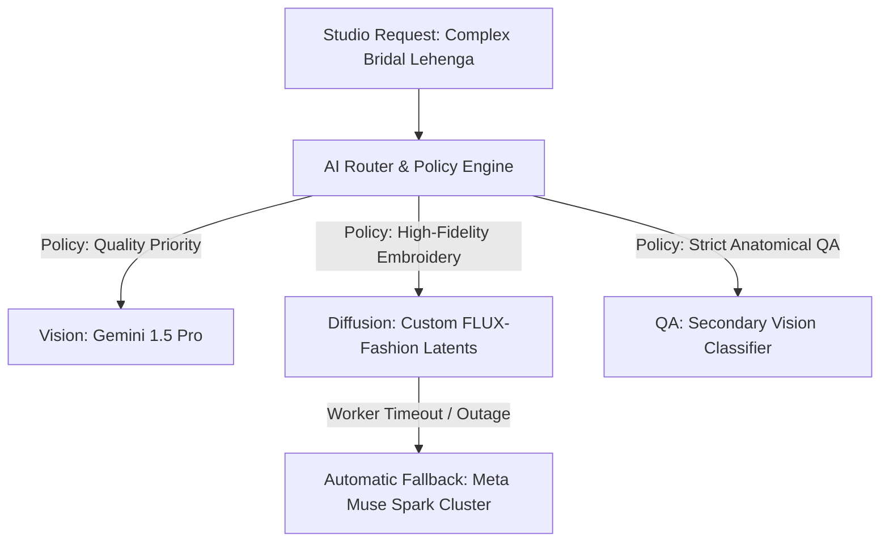

# AI Routing & Model Policies

Youthnic AI Studio does not rely on a single monolithic AI model. Instead, it operates a dynamic **Multi-Provider AI Orchestration Layer** that routes vision extraction, prompt synthesis, diffusion rendering, and quality assurance to the optimal provider based on garment complexity, cost, and availability.

---

## The AI Model Routing Console

Navigate to **Admin > AI Routing** (`/admin/ai-routing-models`):

[SCREENSHOT REQUIRED:
Page: Administration (/admin/ai-routing-models)
Exact State: AI Routing dashboard showing connected model providers (Google Cloud, OpenAI, Fal.ai, Custom GPU Cluster) with active status lights and latency bars.
Exact UI Section: AI Routing & Models control console.
Recommended Crop: 1200x650
Recommended Dimensions: 1200x650
Filename: admin-ai-routing-console.webp]

---

## 1. Provider Routing Policies

Admins can set organization-wide or category-specific routing policies:

<Tabs>
  <Tab title="Quality Priority (Default)">
    - **Objective**: Maximum visual fidelity, exact textile weave preservation, and intricate metallic zari rendering.
    - **Vision Engine**: Google Gemini 1.5 Pro / Claude 3.5 Sonnet.
    - **Diffusion Engine**: 50-step high-precision diffusion with dedicated spatial ControlNet passes.
    - **Best for**: Bridal lehengas, banarasi sarees, luxury pret, hero campaign shots.
  </Tab>

  <Tab title="Cost-Optimized Priority">
    - **Objective**: Lowest cost per image while maintaining commercial catalog compliance.
    - **Vision Engine**: Gemini 1.5 Flash / Qwen-2.5-VL.
    - **Diffusion Engine**: 28-step accelerated latent diffusion.
    - **Savings**: Reduces token and compute cost by ~45%.
    - **Best for**: High-volume everyday basic kurtis, plain t-shirts, loungewear.
  </Tab>

  <Tab title="Latency / Speed Priority">
    - **Objective**: Instant generation for live merchant review sessions.
    - **Routing**: Dispatches strictly to dedicated warm GPU nodes with zero cold-start latency.
    - **Turnaround**: Renders full 5-pose set in under 35 seconds.
  </Tab>
</Tabs>

---

## 2. Automated Circuit Breakers & Fallbacks

To protect against third-party AI provider outages (such as OpenAI or Google Cloud rate limits):

[SCREENSHOT REQUIRED:
Page: Administration (/admin/ai-routing-models)
Exact State: Fallback routing configuration panel showing Primary Provider 'Cluster Alpha' connected with animated fallback arrow to 'Backup Cluster Beta (Auto-Failover On)'.
Exact UI Section: Fallback & Circuit Breaker settings.
Recommended Crop: 750x380
Recommended Dimensions: 750x380
Filename: admin-fallback-circuit-breaker.webp]

- **Health Check Heartbeats**: Every provider endpoint is pinged every 15 seconds.
- **Auto-Failover**: If a primary GPU cluster returns three consecutive 5xx timeout errors, the router switches traffic to the designated backup cluster within 800 milliseconds.
- **Zero User Disruption**: Studio operators and catalog batches continue generating without throwing errors.

---

## Next Steps

- Set financial controls in [Costs & Budgets](/admin/costs-budgets).
- Monitor infrastructure telemetry in [System Health](/admin/system-health).
