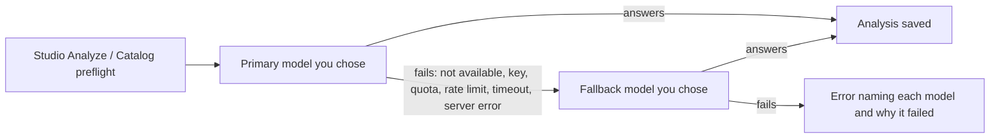

# AI Routing & Model Policies

Youthnic AI Studio runs **exactly the models you choose** in **Administration → AI models**.
For each job you pick a primary model and, where supported, a fallback. The studio tries
the primary first and the fallback second. It never adds, swaps or removes a model on its own.

```mermaid
graph LR
    A[Studio Analyze / Catalog preflight] --> B[Primary model you chose]
    B -->|answers| D[Analysis saved]
    B -->|fails: not available, key, quota, rate limit, timeout, server error| C[Fallback model you chose]
    C -->|answers| D
    C -->|fails| E[Error naming each model and why it failed]
```

---

## The three jobs

| Card in Administration | What it does | Fallback |
| --- | --- | --- |
| **Product truth & pose planning** | Reads the uploaded product photos and builds the six-pose plan (Studio **Analyze**, catalog preflight). | Yes |
| **Image QA** | Checks each generated pose against the product photos, when QA is switched on. | Yes |
| **Image Generation** | Generates the final images. | No |

For each card choose **Provider**, **Model** and **Thinking**, then tick **Use a fallback
provider** and choose the fallback's provider, model and thinking.

[SCREENSHOT REQUIRED:
Page: Administration → AI models
Exact State: Product truth & pose planning card with Primary OpenAI GPT 5.6 Terra and fallback Meta Muse Spark 1.3 Contributor, both CONFIGURED.
Exact UI Section: Primary provider and fallback settings.
Recommended Crop: 760x560
Recommended Dimensions: 760x560
Filename: admin-ai-routing-primary-fallback.webp]

---

## When the fallback is used

The fallback runs only when the primary fails for a reason another model can fix:

- the model is not available to the API key (model not found or no access);
- the provider's API key is missing or rejected;
- the budget, quota or billing limit is reached;
- the provider is rate-limiting or timed out;
- the provider returned an incomplete answer or a server error.

If the request itself is invalid, for example a rejected image, the fallback is not tried.
A different model would not fix the product photos.

<Note>
**Thinking for product analysis runs at Low**, or the lowest level the model supports
(Qwen runs with thinking off). Analysis must finish inside Studio's 180-second wait, and
High reasoning did not. Your model choice is always kept; only the reasoning effort is
lowered for this job.
</Note>

---

## Testing a model

Use **TEST** next to the primary and **TEST FALLBACK** next to the fallback. Each sends a
tiny JSON request to that exact model. A pass proves the API key and model name work.
**CONFIGURED** only means the provider's API key is set on the server.

---

## Reading an analysis error

When analysis cannot run, Studio names every model it tried and the reason each one
failed. For example:

> Every configured vision model failed. OpenAI gpt-5.6-terra: This model is not available to
> the configured API key … · Meta muse-spark-1.3-contributor: Meta Muse Spark is selected for
> vision work but META_MODEL_API_KEY is not configured in Supabase Edge Function secrets.

| The message says | What to do |
| --- | --- |
| *not available to the configured API key* | The provider account cannot use that model. Pick another model, or enable it on the provider account. |
| *… API key … is not configured* | Add that secret to the functions service, or pick a provider whose key is set. |
| *budget or quota is exhausted* | Top up billing with the provider, or switch models. |
| *did not answer in time* | Retry; if it repeats, pick a faster model. |
| *No fallback model is configured* | Tick **Use a fallback provider** and choose one. |

<Warning>
**Muse Spark 1.3 Contributor** is cheaper, but Meta may train on the prompts and product
photos sent to it. Use it only if your organization accepts that.
</Warning>

---

## Next Steps

- Set financial controls in [Costs & Budgets](/admin/costs-budgets).
- Monitor infrastructure telemetry in [System Health](/admin/system-health).
