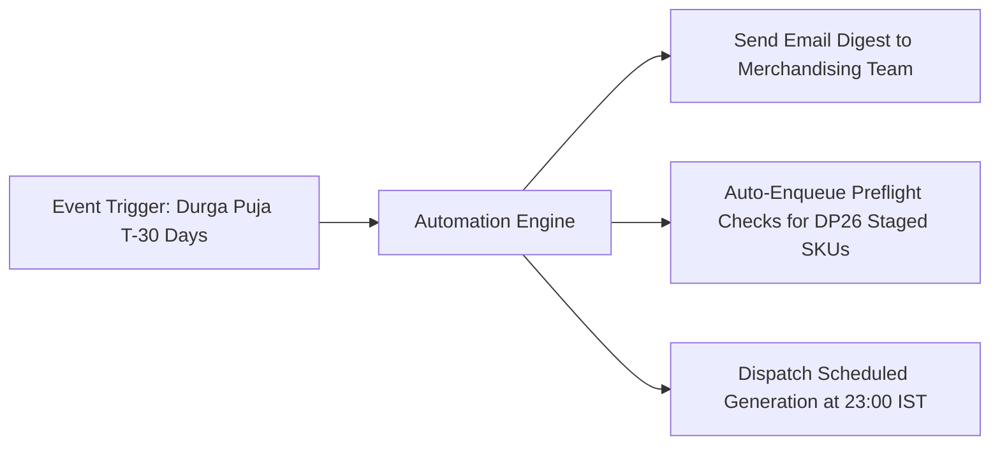

# Automation & Scheduled Reports

The **Automation & Reports** console (`/admin/automation-reports`) allows administrators to set up background cron jobs, recurring analytical digests, automated QA alerts, and scheduled catalog generation runs without requiring manual intervention.

---

## 1. Automated Workflow Recipes

Youthnic includes pre-built enterprise automation recipes:

[SCREENSHOT REQUIRED:
Page: Administration (/admin/automation-reports)
Exact State: Automation Recipes table showing active toggles for 'Overnight Batch Auto-Run', 'Event Lead-Time Alert (T-30)', and 'QA Defect Slack Alert'.
Exact UI Section: Active Automation Recipes table.
Recommended Crop: 1100x450
Recommended Dimensions: 1100x450
Filename: admin-automation-recipes-table.webp]

<CardGroup cols={2}>
  <Card title="Overnight Batch Runner" icon="moon">
    Automatically executes all preflight-approved catalog colourways every weeknight at 11:00 PM IST using off-peak GPU workers.
  </Card>
  <Card title="Event Milestone Lead-Time Trigger" icon="bell">
    Automatically emails assigned merchandisers exactly 30 days before any major cultural festival or marketplace sale event.
  </Card>
  <Card title="QA Defect Auto-Escalation" icon="triangle-exclamation">
    If an image scores below 70 points after two automated retries, automatically flags the SKU and posts a webhook message to the team's Slack channel.
  </Card>
  <Card title="Automated Asset Archival" icon="box-archive">
    Moves unedited draft photoshoots older than 90 days to cold storage to optimize cloud storage utilization.
  </Card>
</CardGroup>

---

## 2. Scheduled Executive Reports

Configure automated report generation sent directly to leadership:

[SCREENSHOT REQUIRED:
Page: Administration (/admin/automation-reports)
Exact State: 'Schedule Report' drawer open with cadence set to 'Weekly on Mondays at 08:00 AM', format PDF + CSV, and executive recipients selected.
Exact UI Section: Schedule Report configuration drawer.
Recommended Crop: 500x600
Recommended Dimensions: 500x600
Filename: admin-schedule-report-drawer.webp]

- **Weekly Operational Throughput**: Summary of total images generated, first-pass QA success rate, and active SKUs in production.
- **Monthly Financial & Token Spend**: Executive PDF detailing total credit consumption, dollar costs per department team, and provider usage.
- **Quality Assurance Defect Audit**: Comprehensive breakdown of flagged images, common defect categories, and retried items.

---

## Next Steps

- Configure multi-model load balancing in [AI Routing & Models](/admin/ai-routing-models).
- Establish financial guardrails in [Costs & Budgets](/admin/costs-budgets).
