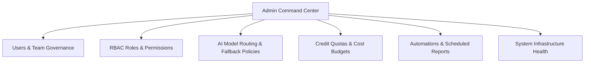

# Administration Overview

The **Administration Hub** (`/admin`) is restricted to workspace administrators and enterprise IT leads. It provides centralized control over user accounts, department teams, role-based access permissions (RBAC), multi-provider AI routing, monthly credit budgets, and system health.

---

## Administrative Capabilities

<CardGroup cols={2}>
  <Card title="User & Team Governance" icon="users-gear">
    Provision user accounts, invite external freelance photographers or stylists, and organize members into department teams with isolated campaign permissions.
  </Card>
  <Card title="Role-Based Access Control (RBAC)" icon="shield-halved">
    Enforce granular permissions: control who can generate images, who can approve styling, who can download high-res files, and who can view billing data.
  </Card>
  <Card title="Multi-Provider AI Routing" icon="route">
    Configure intelligent AI routing rules: dynamically route tasks between Gemini, OpenAI, and custom GPU diffusion clusters based on cost, latency, or visual fidelity.
  </Card>
  <Card title="Financial & Budget Safeguards" icon="vault">
    Set departmental credit quotas, enforce monthly spend caps, and configure low-balance warnings to prevent billing surprises.
  </Card>
</CardGroup>

---

## The Admin Workspace Layout

Navigate to **Admin** (`/admin`) from the lower left navigation menu (visible only to users with the `admin` role):

[SCREENSHOT REQUIRED:
Page: Administration (/admin)
Exact State: Admin overview screen showing sidebar sub-navigation, workspace license status, active member count, and system status badge.
Exact UI Section: Full Administration dashboard view.
Recommended Crop: 1920x950
Recommended Dimensions: 1400x690
Filename: admin-workspace-overview.webp]

The administration console is organized into modular sections:
- **Identity & Access**: [Users](/admin/users), [Teams](/admin/teams), [Roles & Permissions](/admin/roles-permissions)
- **AI Infrastructure**: [AI Routing & Models](/admin/ai-routing-models), [System Health](/admin/system-health)
- **Finance & Operations**: [Costs & Budgets](/admin/costs-budgets), [Automation & Reports](/admin/automation-reports)

---

## Next Steps

- Manage member accounts in [Users Overview](/admin/users).
- Organize departments in [Teams Management](/admin/teams).
- Configure model routing in [AI Routing & Models](/admin/ai-routing-models).
