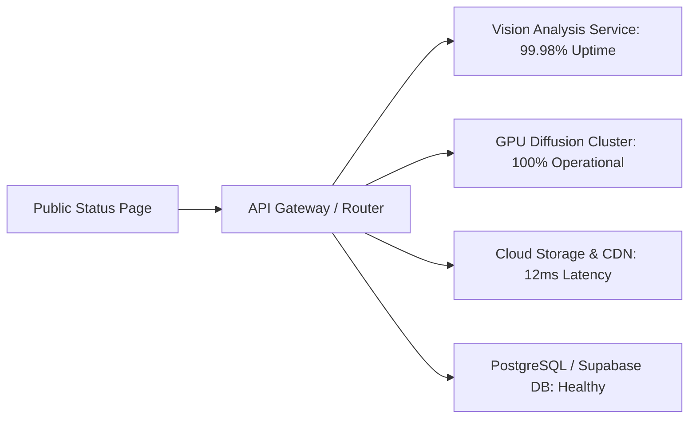

# System Health & Infrastructure

The **System Health** console (`/admin/system-health`) provides engineering leads and IT administrators with real-time operational telemetry across all microservices that power Youthnic AI Studio.

---

## The Infrastructure Status Console

[SCREENSHOT REQUIRED:
Page: Administration (/admin/system-health)
Exact State: System Health dashboard showing green 'All Systems Operational' banner, uptime bars for 90 days, and microservice latency gauges.
Exact UI Section: System Health dashboard view.
Recommended Crop: 1200x650
Recommended Dimensions: 1200x650
Filename: admin-system-health-dashboard.webp]

---

## Tracked Microservices

<AccordionGroup>
  <Accordion title="1. Multi-Modal Vision Processing Engine" icon="eye">
    - **Status**: Operational (99.98% Uptime)
    - **P95 Latency**: 4.2 seconds
    - **Function**: Image ingestion, background removal, fabric taxonomy extraction, and colorimetry analysis.
  </Accordion>

  <Accordion title="2. Distributed GPU Diffusion Worker Cluster" icon="server">
    - **Status**: Operational (100% Active)
    - **Active Nodes**: 24 GPU instances
    - **Average Render Time**: 48 seconds per 5-pose set
    - **Function**: Iterative latent diffusion synthesis, face restoration, and 4K latent upscaling.
  </Accordion>

  <Accordion title="3. Asset Storage & Global CDN" icon="database">
    - **Status**: Operational
    - **Storage Consumed**: 4.2 TB across 42,000+ assets
    - **Edge Cache Hit Ratio**: 94.8%
    - **Function**: Lossless storage of uploaded garment references and generated WebP/JPEG catalog files.
  </Accordion>

  <Accordion title="4. Core Database & Session State" icon="table">
    - **Status**: Operational
    - **Connection Pool**: 14% utilization
    - **Function**: User authentication, SKU metadata, team memberships, and generation audit logs.
  </Accordion>
</AccordionGroup>

---

## Status Subscriptions & Webhooks

Admins can subscribe to real-time incident alerts:
- **Slack Webhook**: Pushes incident notices to your internal `#devops` or `#tech-alerts` channel.
- **SMS / PagerDuty**: Alert IT leads if rendering latency exceeds 120 seconds.
- **Public Status Page**: View historical uptime logs at [status.youthnic.com](https://status.youthnic.com).

---

## Next Steps

- Consult common fixes in [Troubleshooting Overview](/troubleshooting/overview).
- Review [Frequently Asked Questions](/faq/general).
