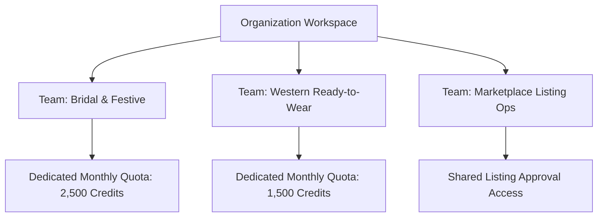

# Teams Management

For medium and enterprise fashion brands, visual production is divided across multiple product divisions (e.g. *Bridal & Couture*, *Festive Ethnic*, *Western Everyday*, *Men's Wear*).

The **Teams** console (`/admin/teams`) allows administrators to create functional groups, assign team leads, and isolate campaign workflows.

---

## The Teams Overview

[SCREENSHOT REQUIRED:
Page: Administration (/admin/teams)
Exact State: Teams management view displaying 4 team cards with member avatars, team lead badges, active campaign counts, and monthly credit burn bars.
Exact UI Section: Teams overview grid.
Recommended Crop: 1200x550
Recommended Dimensions: 1200x550
Filename: admin-teams-overview-grid.webp]

---

## Creating a New Team

Click the **+ Create Team** button:

[SCREENSHOT REQUIRED:
Page: Administration (/admin/teams)
Exact State: 'Create New Team' modal open with fields for Team Name, Department Tag, Team Lead selector, and Monthly Credit Quota slider.
Exact UI Section: Create Team modal.
Recommended Crop: 550x450
Recommended Dimensions: 550x450
Filename: admin-create-team-modal.webp]

<Steps>
  <Step title="Team Name & Tag">
    Enter the department name (e.g. *"Luxury Bridal Division"*) and internal tag code (`LBD`).
  </Step>
  <Step title="Designate Team Lead">
    Select a senior team member as the **Team Lead**. Team leads have automatic approval authority for all catalog campaigns initiated within their team.
  </Step>
  <Step title="Allocate Monthly Credit Quota">
    Assign a dedicated credit budget (e.g. `2,000 Credits / Month`). Renders launched by team members are deducted from this team pool rather than a shared company balance.
  </Step>
  <Step title="Add Team Members">
    Select users from your directory to include in the team.
  </Step>
</Steps>

---

## Team Workspace Isolation

When team-based privacy is enabled:
- Members of the *Bridal Team* only see plans, catalogs, and shoots created within their team.
- Workspace administrators retain global visibility across all teams.

---

## Next Steps

- Define permission privileges in [Roles & Permissions](/admin/roles-permissions).
- Configure automated workflows in [Automation & Reports](/admin/automation-reports).
