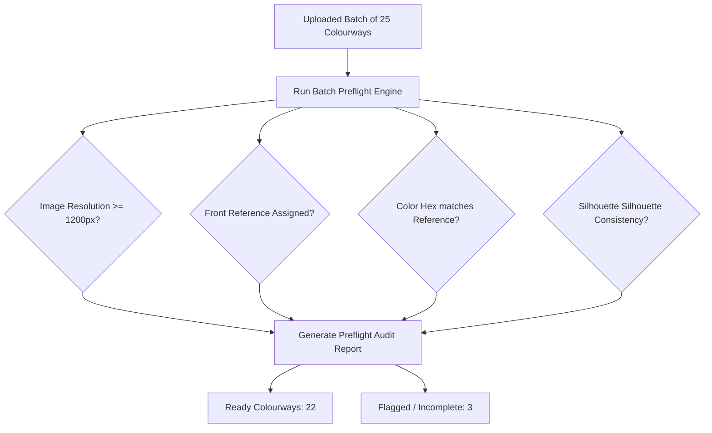

# AI Analysis & Preflight Validation

Before burning expensive generation credits on massive multi-SKU batches, Youthnic AI Studio executes an automated **Batch Preflight Check**. This acts as an automated inspection gate that detects corrupt files, low-resolution uploads, missing angles, and colorway mismatches.

---

## Triggering Batch Preflight

Click the **Run Preflight Check** button on the catalog toolbar:

[SCREENSHOT REQUIRED:
Page: Catalog Production (/planning?tab=catalogs)
Exact State: Toolbar showing 'Run Preflight Check' button with tooltip and a progress bar analyzing 24 colourways in parallel.
Exact UI Section: Top action toolbar in catalog workspace.
Recommended Crop: 600x160
Recommended Dimensions: 600x160
Filename: catalog-preflight-toolbar-action.webp]

The preflight engine analyzes all uploaded colourways concurrently in 15–30 seconds.

---

## What the Preflight Engine Validates

<AccordionGroup>
  <Accordion title="1. Optical Resolution & Blur Score" icon="image">
    Verifies that every uploaded front, back, and fabric reference meets the minimum 1200 x 1600 px resolution threshold. Scans for motion blur, lens smudges, and heavy JPEG compression artifacts.
  </Accordion>

  <Accordion title="2. Color Dye-Lot vs. Target Swatch Matching" icon="droplet">
    Extracts the dominant optical hex code from the uploaded garment photo and compares it to the target color name assigned in the SKU table. If a photo labeled *"Mustard Yellow"* is detected as *"Olive Green"*, a warning flag is raised.
  </Accordion>

  <Accordion title="3. Silhouette Consistency Across Variants" icon="shapes">
    Ensures that all colorways within a parent style share identical silhouette geometry (e.g. confirming all variants are floor-length Anarkalis rather than mixing in a short kurti).
  </Accordion>

  <Accordion title="4. Essential Reference Completeness" icon="circle-check">
    Confirms that every colorway has at least one valid front reference photo.
  </Accordion>
</AccordionGroup>

---

## Preflight Summary Report

Once the check finishes, the **Preflight Audit Summary** drawer slides open:

[SCREENSHOT REQUIRED:
Page: Catalog Production (/planning?tab=catalogs)
Exact State: Preflight Audit Summary drawer open showing 18 'Ready', 2 'Warnings', and 1 'Error' with actionable fix links.
Exact UI Section: Preflight Audit Summary drawer.
Recommended Crop: 500x700
Recommended Dimensions: 500x700
Filename: catalog-preflight-summary-drawer.webp]

- Ready (18): Passed all checks; green check badge applied.
- Warnings (2): Back reference missing. Allowed to generate, but user is warned that rear styling will be AI-inferred.
- Errors (1): Image resolution too low (under 800px wide). Generation blocked until a higher-resolution file is uploaded.

---

## Next Steps

- Proceed to [Styling Approval](/catalog-production/styling-approval).
- Understand how to filter [Ready vs. Incomplete Colourways](/catalog-production/ready-incomplete-colourways).
