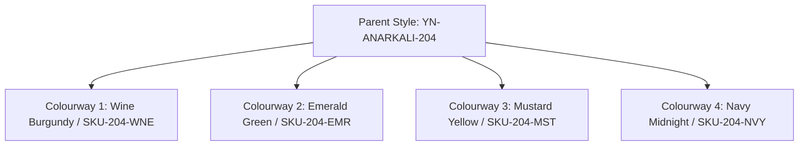

# Colourways & SKUs

Fashion collections frequently produce a single garment design across multiple colorways. Youthnic AI Studio's catalog architecture groups these variants under a **Parent Style SKU**, allowing shared styling parameters while maintaining distinct colorway assets.



---

## Adding Colourways Manually

To add individual colorways inside your catalog campaign:

[SCREENSHOT REQUIRED:
Page: Catalog Production (/planning?tab=catalogs)
Exact State: 'Add Colourway' dialog open with fields for SKU Code, Color Name, Color Swatch Hex, and Fabric Notes.
Exact UI Section: Add Colourway dialog.
Recommended Crop: 550x480
Recommended Dimensions: 550x480
Filename: catalog-add-colourway-dialog.webp]

<Steps>
  <Step title="Click Add Colourway">
    Click the **+ Add Colourway** button on the catalog toolbar.
  </Step>
  <Step title="Enter Colourway SKU & Title">
    Input the unique child SKU code (e.g. `YN-ANARKALI-204-MST`) and color name (*"Mustard Gold"*).
  </Step>
  <Step title="Select Target Color Swatch">
    Pick the approximate physical color swatch from the palette picker. This primes the vision preflight engine to verify that uploaded garment photos match the intended dye lot.
  </Step>
  <Step title="Save Colourway Card">
    Click **Add to Catalog**. An empty colourway card appears on your production board, ready for photo uploads.
  </Step>
</Steps>

---

## Bulk CSV Import for Large Collections

For collections exceeding 10 SKUs, importing via CSV saves considerable time:

[SCREENSHOT REQUIRED:
Page: Catalog Production (/planning?tab=catalogs)
Exact State: CSV Import modal showing a preview table with 15 parsed SKUs and validation checkmarks.
Exact UI Section: CSV Bulk Import modal with table preview.
Recommended Crop: 800x520
Recommended Dimensions: 800x520
Filename: catalog-csv-import-preview.webp]

### Standard CSV Structure

```csv
parent_sku,sku,color_name,color_hex,category,garment_title
YN-ANARKALI-204,YN-ANARKALI-204-WNE,Wine Burgundy,#5B1E31,Anarkali Suit,Wine Georgette Embroidered Anarkali
YN-ANARKALI-204,YN-ANARKALI-204-EMR,Emerald Green,#046307,Anarkali Suit,Emerald Georgette Embroidered Anarkali
YN-ANARKALI-204,YN-ANARKALI-204-MST,Mustard Gold,#E1AD01,Anarkali Suit,Mustard Georgette Embroidered Anarkali
YN-ANARKALI-204,YN-ANARKALI-204-NVY,Navy Midnight,#000080,Anarkali Suit,Navy Georgette Embroidered Anarkali
```

Upload the CSV file into the **Import SKUs** drawer. Youthnic automatically creates all colourway cards and initializes their preflight slots.

---

## Colourway Status Indicators

Each colourway card displays a live readiness state:
- <span style={{color: '#9ca3af', fontWeight: 600}}>⚪ Draft / Incomplete</span>: Missing required front reference photos. Cannot be queued for generation.
- <span style={{color: '#f59e0b', fontWeight: 600}}>🟡 Preflight Ready</span>: References uploaded; pending automated AI vision analysis and color match verification.
- <span style={{color: '#10b981', fontWeight: 600}}>🟢 Generation Ready</span>: Validated, styling locked, ready to render.
- <span style={{color: '#3b82f6', fontWeight: 600}}>🔵 In Progress</span>: Currently rendering on GPU worker queue.
- <span style={{color: '#059669', fontWeight: 600}}>✅ Completed</span>: All 5 poses rendered, verified by QA, and ready for export.

---

## Next Steps

- Proceed to [Upload Product References](/catalog-production/upload-references).
- Configure [Shared Styling & Model Reference](/catalog-production/shared-styling-model).
