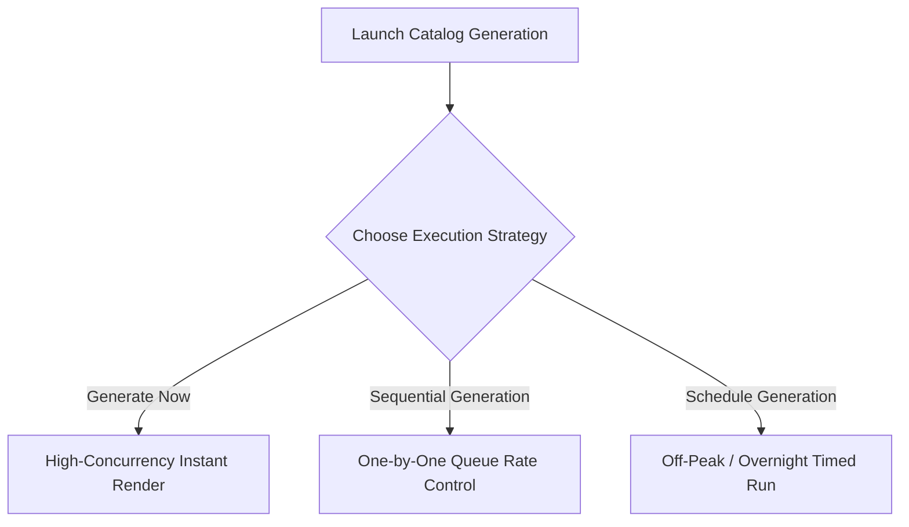

# Generate Catalog

When your colourways are staged and approved, you can initiate catalog rendering. Youthnic AI Studio provides three execution strategies depending on your urgency, batch size, and GPU concurrency requirements.

---

## The Three Generation Execution Modes

Click the **Generate Catalog** dropdown in the top right of the workspace:

[SCREENSHOT REQUIRED:
Page: Catalog Production (/planning?tab=catalogs)
Exact State: 'Generate Catalog' dropdown menu expanded showing 'Generate Now', 'Schedule Generation', and 'Sequential Queue' options with credit estimates.
Exact UI Section: Top right catalog action menu.
Recommended Crop: 420x350
Recommended Dimensions: 420x350
Filename: catalog-generate-modes-dropdown.webp]

<Tabs>
  <Tab title="1. Generate Now (High Concurrency)">
    **Best for**: Fast turnarounds on 2 to 10 colourways.
     **Execution**: Dispatches all poses across all selected colourways simultaneously into the GPU worker cluster.
     **Performance**: Renders 10 colourways (50 total images) in approximately 3 to 5 minutes.
  </Tab>

  <Tab title="2. Sequential Generation (Controlled Queue)">
    **Best for**: Moderate batches (10 to 30 colourways) or accounts with strict provider rate limits.
     **Execution**: Renders one colourway (5 poses) completely before advancing to the next colourway.
     **Advantage**: Allows continuous real-time inspection. If an unexpected garment prompt issue is detected on colourway 1, you can pause the queue immediately without burning credits on the remaining 29 items.
  </Tab>

  <Tab title="3. Schedule Generation (Overnight / Timed)">
    **Best for**: Massive collections (30 to 100+ colourways).
     **Execution**: Schedules the job to trigger at a designated timestamp (e.g. *11:00 PM IST* during off-peak cloud GPU windows).
     **Advantage**: Reduces infrastructure load and delivers a complete, validated catalog package by 9:00 AM the following morning.
  </Tab>
</Tabs>

---

## Scheduling a Timed Generation Run

To configure scheduled rendering:

[SCREENSHOT REQUIRED:
Page: Catalog Production (/planning?tab=catalogs)
Exact State: 'Schedule Batch Generation' modal open showing date picker set to tomorrow, time picker set to 02:00 AM, and notification email recipients.
Exact UI Section: Schedule Generation modal dialog.
Recommended Crop: 550x450
Recommended Dimensions: 550x450
Filename: catalog-schedule-generation-modal.webp]

<Steps>
  <Step title="Select Schedule Generation">
    From the Generate dropdown, click **Schedule for Later**.
  </Step>
  <Step title="Set Execution Time">
    Choose the target date and time. The interface displays local time and UTC.
  </Step>
  <Step title="Configure Completion Alerts">
    Enter team email addresses or Slack webhook channels to receive instant notification upon batch completion.
  </Step>
  <Step title="Lock & Enqueue">
    Click **Confirm Schedule**. The catalog enters the `Scheduled` state and begins automated processing at the appointed hour.
  </Step>
</Steps>

---

## Stopping or Pausing an Active Batch

If you need to halt an active catalog run:
1. Click **Pause Batch** or **Stop Generation** in the top control bar.
2. The current active rendering colourway finishes its cycle, and all subsequent queued colourways are frozen.
3. Unspent credits remain safely in your balance.

---

## Next Steps

- Track real-time progress across all SKUs in [Production Tracking](/catalog-production/production-tracking).
- Handle edge-case rendering issues in [Retry Failed Colourway](/catalog-production/retry-failed-colourway).
