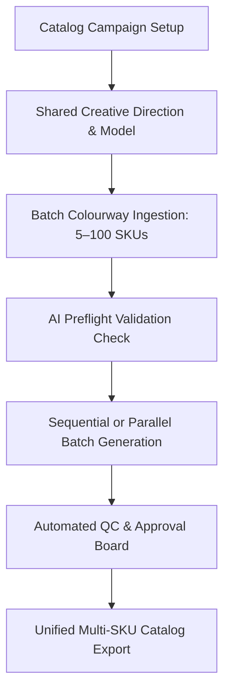

# Catalog Production Overview

While the [Studio](/studio/overview) is optimized for bespoke single-garment photoshoots, **Catalog Production** is built for high-volume enterprise e-commerce pipelines. It enables fashion brands, manufacturers, and catalog agencies to produce complete 5-pose photoshoots across dozens of colourways and SKUs in a single automated batch.

---

## Why Use Catalog Production?

<CardGroup cols={2}>
  <Card title="Shared Brand Identity" icon="users">
    Lock a single model persona, lighting scheme, and studio backdrop across 20+ colorways of a garment style, ensuring visual harmony across your e-commerce listing grid.
  </Card>
  <Card title="Multi-SKU Concurrency" icon="bolt">
    Ingest hundreds of SKUs via batch upload or spreadsheet CSV. The system organizes each colorway under its parent style code automatically.
  </Card>
  <Card title="Automated Preflight" icon="shield-check">
    Eliminates bad runs before spending credits. The preflight checker flags missing back photos, low-resolution uploads, or unverified colorways before rendering begins.
  </Card>
  <Card title="Scheduled Overnight Rendering" icon="clock">
    Schedule heavy batches to render during off-peak hours with automated credit budget protection and rate limiting.
  </Card>
</CardGroup>

---

## The 5-Stage Production Pipeline

Catalog jobs advance through a structured 5-stage production board:

<Frame caption="Live Catalog Production & Planning Console — showing 1,000 active SKUs, Automated Sync, Batch Auto-Start, Stage Tracking (Quality Review, Reference Assets Pending), and QC Status">
  
</Frame>

1. **Requested (`requested`)**: The catalog campaign is initialized, colourways are uploaded, and references are staged.
2. **Generation (`generation`)**: GPU workers render the five-pose sequence for all ready colourways sequentially or concurrently.
3. **Quality Control (`qc`)**: Automated AI quality scorecards and merchandiser visual reviews inspect garment fidelity and anatomy.
4. **Listing Ready (`listing`)**: Images are watermarked, formatted for marketplace channels (Amazon, Myntra, Nykaa), and metadata is compiled.
5. **Completed (`completed`)**: Assets are archived, exported to ZIP packages, or pushed to your CDN/PIM.

---

## Next Steps

- Walk through creating a new campaign in [Create a Catalog](/catalog-production/create-catalog).
- Learn how to structure [Colourways & SKUs](/catalog-production/colourways-skus).
- Set up [Shared Styling & Model References](/catalog-production/shared-styling-model).
