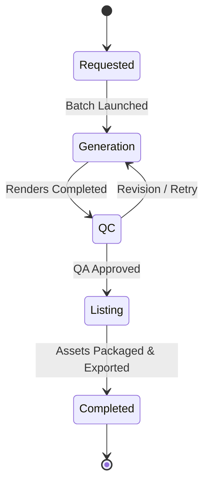

# Production Tracking

The **Production Tracking** interface provides real-time visibility across all active, queued, and completed catalog batches. It serves as mission control for catalog operations managers and merchandising teams.

---

## Production Board Views

Switch between two view modes in the top right toggle:

<Frame caption="Live Catalog Production Tracking Console — showing multi-view options (Overview, Kanban, List, Handoffs), Stage Progress bars, Generation Durations (4m 47s), and QC Status">
  
</Frame>

<Tabs>
  <Tab title="1. Kanban Board View">
    Visual cards organized into 5 production columns:
    - **Requested**: Staged campaigns awaiting sample photos or approval.
    - **Generation**: Active batches rendering across GPU workers.
    - **Quality Control (QC)**: Completed images undergoing automated validation or manual sign-off.
    - **Listing Preparation**: Format conversion, EXIF tagging, and marketplace resizing.
    - **Completed**: Fully packaged and exported campaigns.
  </Tab>
  <Tab title="2. Table / Spreadsheet View">
    High-density tabular list showing SKU, colorway, assigned model, render start time, elapsed duration, credit spend, and status badges. Ideal for monitoring 50+ concurrent items.
  </Tab>
</Tabs>

---

## Live Progress Metrics

Inside any active catalog campaign card:

[SCREENSHOT REQUIRED:
Page: Catalog Production (/planning?tab=catalogs)
Exact State: Live progress bar inside campaign card showing '18 of 24 Colourways Complete (75%)', elapsed time 04m 12s, ETA 01m 20s.
Exact UI Section: Campaign progress status widget.
Recommended Crop: 600x200
Recommended Dimensions: 600x200
Filename: catalog-live-progress-widget.webp]

- **Completion Percentage**: Real-time progress bar tracking rendered poses versus total batch size.
- **Worker Allocation**: Number of parallel GPU worker threads assigned to your organization.
- **Estimated Time of Completion (ETA)**: Dynamic calculation based on current worker throughput.
- **Quality Pass Rate**: Percentage of images that passed the automated QA score on first pass.

---

## Next Steps

- Handle occasional render timeouts in [Retry Failed Colourway](/catalog-production/retry-failed-colourway).
- Export completed assets in [Download Catalog Results](/catalog-production/download-results).
