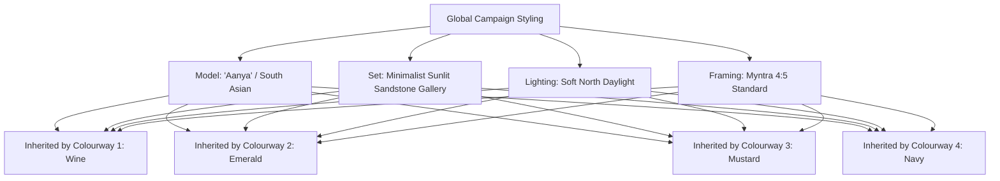

# Shared Styling & Model Reference

Consistency is the hallmark of premium fashion e-commerce. When customers browse a product listing and click between different colorway swatches, the model identity, camera framing, backdrop environment, and lighting must remain harmonious.

Youthnic AI Studio's **Shared Styling Engine** ensures that all colourways in a catalog campaign inherit identical creative parameters.

---

## Configuring Global Campaign Styling

In the left sidebar of the Catalog Production workspace, open the **Shared Styling & Creative Direction** card:

[SCREENSHOT REQUIRED:
Page: Catalog Production (/planning?tab=catalogs)
Exact State: Shared Styling sidebar open with selected model persona 'Aanya', set preset 'Jaipur Sandstone Niche', and lighting 'Directional Daylight'.
Exact UI Section: Left sidebar shared styling panel.
Recommended Crop: 380x750
Recommended Dimensions: 380x750
Filename: catalog-shared-styling-sidebar.webp]

<CardGroup cols={2}>
  <Card title="Model Identity Lock" icon="user-lock">
    Select a model persona to represent the entire campaign. Facial morphology, skin tone, hair styling, and demographic age are locked across every colorway.
  </Card>
  <Card title="Shared Architectural Set" icon="building">
    Choose the ambient backdrop (e.g. *Jaipur Sandstone Gallery* or *Clean White Cyclorama*). All 5 poses per colourway render within this consistent environment.
  </Card>
  <Card title="Lighting & Camera Calibration" icon="lightbulb">
    Locks optical color temperature, shadow direction, and lens focal length (85mm portrait telephoto) so all products exhibit identical contrast ratios.
  </Card>
  <Card title="Shared Five-Pose Plan" icon="film">
    Applies the standardized 5-pose composition (Hero, 45°, Back, Editorial, Detail) across every colourway in the batch.
  </Card>
</CardGroup>

---

## Overriding Styling for Specific Colourways

While global styling is inherited by default, certain garments require distinct accessory pairings:
- An **Emerald Green** suit may look best with *Antique Gold Zari Juttis* and *Polki Choker*.
- A **Navy Midnight** suit in the same batch may require *Silver Oxidized Jhumkas* and *Metallic Silver Heels*.

[SCREENSHOT REQUIRED:
Page: Catalog Production (/planning?tab=catalogs)
Exact State: Per-colourway styling override drawer open for Colourway 'Navy Midnight', showing customized jewellery toggle highlighted.
Exact UI Section: Colourway styling override drawer.
Recommended Crop: 500x600
Recommended Dimensions: 500x600
Filename: catalog-colourway-styling-override.webp]

<Steps>
  <Step title="Open Colourway Settings">
    Click the **Edit Styling** icon on the specific colourway card.
  </Step>
  <Step title="Toggle Override">
    Switch on **Override Shared Campaign Styling**.
  </Step>
  <Step title="Modify Target Parameters">
    Change the jewelry, footwear, or drape without altering the model identity or architectural backdrop.
  </Step>
</Steps>

---

## Next Steps

- Run the automated batch check in [AI Analysis & Preflight](/catalog-production/ai-analysis-preflight).
- Review approval gates in [Styling Approval](/catalog-production/styling-approval).
