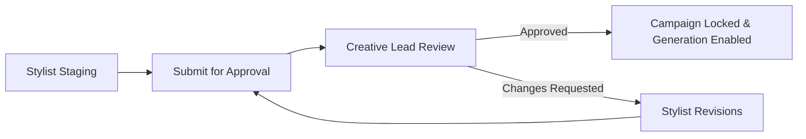

# Styling Approval

In enterprise fashion brands, creative sign-off is mandatory before committing large budgets to visual production. Youthnic AI Studio features a built-in **Styling Approval Workflow** that establishes clear governance between merchandisers, styling leads, and catalog operators.

---

## The Approval Gate

When the **Require Creative Approval** setting is toggled on in [Workspace Administration](/admin/roles-permissions), non-admin users cannot trigger batch generation until an authorized reviewer approves the campaign.

[SCREENSHOT REQUIRED:
Page: Catalog Production (/planning?tab=catalogs)
Exact State: Banner across catalog workspace showing 'Pending Creative Lead Approval. 24 colourways staged by Ritu S.' with an 'Approve Campaign' button for managers.
Exact UI Section: Top approval banner in catalog hub.
Recommended Crop: 1200x160
Recommended Dimensions: 1200x160
Filename: catalog-approval-banner-pending.webp]

---

## Reviewing Campaign Parameters

Reviewers inspect a consolidated visual contact sheet containing:

[SCREENSHOT REQUIRED:
Page: Catalog Production (/planning?tab=catalogs)
Exact State: Creative review sheet open displaying the selected model persona, backdrop set, jewellery pairings, and swatch thumbnails for all 24 colourways side-by-side.
Exact UI Section: Review Contact Sheet modal.
Recommended Crop: 1400x800
Recommended Dimensions: 1400x800
Filename: catalog-review-contact-sheet.webp]

1. **Model Persona & Demographics**: Confirms the selected AI model aligns with the brand's seasonal lookbook.
2. **Accessory Harmony**: Ensures jewellery and footwear do not clash with garment necklines or embellishment types.
3. **Colorway Completeness**: Verifies all intended seasonal shades are accounted for.
4. **Estimated Budget**: Shows total credit consumption (e.g. `24 colourways × 5 poses = 120 Credits`).

---

## Approving or Requesting Changes

<Tabs>
  <Tab title="One-Click Approval">
    Click **Approve Campaign & Unlock Generation**. The campaign status advances to **Approved**, and the batch generation triggers become active. The approval timestamp and reviewer name are logged in the audit trail.
  </Tab>
  <Tab title="Request Changes with Annotations">
    Click **Request Changes**. A feedback dialog allows the lead to pinpoint specific colourways (e.g. *"Change footwear on Mustard Gold from heels to mojaris"*). The campaign status reverts to **Revisions Requested**.
  </Tab>
</Tabs>

---

## Next Steps

- Review [Ready vs. Incomplete Colourways](/catalog-production/ready-incomplete-colourways).
- Learn how to trigger [Generate Catalog](/catalog-production/generate-catalog).
