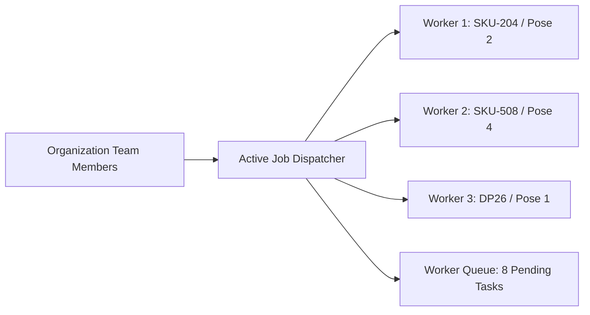

# Active Jobs & Live Progress

The **Active Jobs** console on the Dashboard provides real-time visibility into all generative tasks currently being processed by Youthnic AI Studio's distributed GPU worker cluster.

---

## The Active Jobs Monitor

Located directly below the top KPI banner:

[SCREENSHOT REQUIRED:
Page: Dashboard (/dashboard)
Exact State: Active Jobs panel showing 4 running jobs with live circular progress bars, user avatars, SKU tags, and elapsed duration timers.
Exact UI Section: Active Jobs live telemetry widget.
Recommended Crop: 1200x420
Recommended Dimensions: 1200x420
Filename: dashboard-active-jobs-widget.webp]

Each job row displays:
- **SKU & Campaign Code**: Clickable link to jump directly to the live Studio or Catalog view.
- **Initiating User**: Team member avatar and name who launched the render.
- **Job Stage**: `Queued`, `Conditioning`, `Generating (Diffusion)`, `Validating QA`.
- **Elapsed Duration & ETA**: Live second-by-second countdown timer.
- **Worker Node ID**: Cloud GPU cluster identifier handling the job.

---

## Managing Active Jobs

Workspace administrators and job owners have access to inline controls:

<CardGroup cols={3}>
  <Card title="Inspect Live Flow" icon="eye">
    Opens the real-time node graph viewer showing the exact conditioning layers and intermediate diffusion latents.
  </Card>
  <Card title="Boost Priority" icon="arrow-up-right-dots">
    (Admin only) Moves a critical deadline job to the top of the GPU queue ahead of scheduled overnight batches.
  </Card>
  <Card title="Terminate Job" icon="stop">
    Aborts a runaway or accidental job immediately and triggers an automated credit refund for unrendered poses.
  </Card>
</CardGroup>

---

## Next Steps

- Analyze multi-modal token telemetry in [Token Usage Telemetry](/dashboard/token-usage-telemetry).
- Monitor financial expenses in [AI Costs & Organization Spend](/dashboard/ai-costs-organization-spend).
