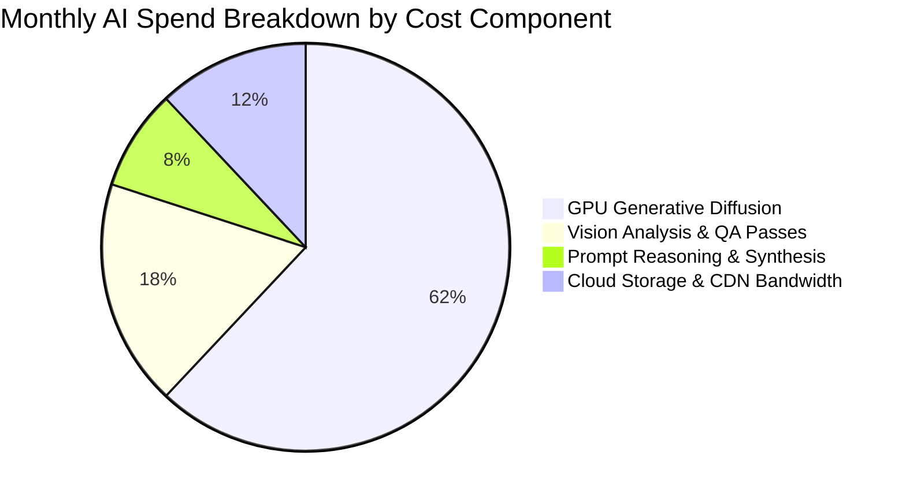

# AI Costs & Organization Spend

Understanding the true unit economics of AI photography is essential for brand profitability. The **AI Costs & Organization Spend** dashboard breaks down expenses by SKU, campaign, model provider, and team department.

---

## The Spend Overview Console

Located in the financial section of the Dashboard:

<Frame caption="Live Generation Cost & Daily USD breakdown on Youthnic AI Studio Dashboard — showing $118.5705 actual spend via OpenAI Admin API">
  
</Frame>

---

## Unit Economics: Traditional vs. AI Studio

| Metric | Traditional Photography Studio | Youthnic AI Studio |
| :--- | :--- | :--- |
| **Cost per 5-Pose Shoot** | ₹8,000 – ₹15,000 ($100 – $180) | **₹85 – ₹150 ($1.00 – $1.80)** |
| **Turnaround Time** | 7 to 14 Days | **60 to 90 Seconds** |
| **Model / Studio Hire** | Variable agency day rates | **Included in credits** |
| **Sample Steaming & Logistics** | High physical overhead | **Zero overhead** |
| **Savings Realized** | Baseline | **> 95% Production Cost Reduction** |

---

## Cost Breakdown by Model Provider

For organizations with multi-provider AI routing enabled:

[SCREENSHOT REQUIRED:
Page: Dashboard (/dashboard)
Exact State: Provider spend breakdown table showing columns: Provider Name, Total API Calls, Token Count, Total USD, and % of Total Spend.
Exact UI Section: Provider cost breakdown table.
Recommended Crop: 750x350
Recommended Dimensions: 750x350
Filename: dashboard-provider-cost-table.webp]

- **Vision Extraction (Google Cloud / Gemini)**: Billed per million vision tokens for garment silhouette and color extraction.
- **Diffusion Synthesis (Dedicated Worker Cluster)**: Billed per GPU compute second.
- **Prompt Synthesis (OpenAI / Anthropic)**: Billed per 1k input/output tokens.

---

## Budget Caps & Hard Limits

Administrators can enforce spending guardrails:
- **Monthly Soft Alert**: Sends an email notification when spend reaches 80% of budget.
- **Hard Credit Cap**: Freezes new batch rendering if an organization reaches its monthly ceiling until an admin approves an increase.

---

## Next Steps

- Review long-term trends in [14-Day Production Analytics](/dashboard/analytics-14-day).
- Monitor live operational events in [Recent Activity Feed](/dashboard/recent-activity).
