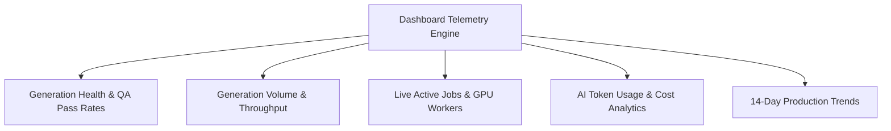

# Dashboard Overview

The **Dashboard** (`/dashboard`) provides real-time visibility into your organization's AI fashion production pipeline. It aggregates generation health, throughput volume, token consumption, infrastructure spend, and live job status into a single mission-control interface.

---

## The Dashboard Workspace

Navigate to **Dashboard** (`/dashboard`) from the primary navigation bar:

<Frame caption="Live Operations Summary on Youthnic AI Studio Dashboard — showing Generation Health, 14-Day Throughput, Token Telemetry, and OpenAI Admin API Generation Cost">
  
</Frame>

The dashboard is structured into five analytical zones:

<CardGroup cols={2}>
  <Card title="1. Authoritative KPI Ribbon" icon="chart-simple">
    Displays **Generations** (total jobs started), **Provider Tokens** (e.g. 89.5 Lakh tokens reported across image responses), and **Generation Cost** (authoritative OpenAI Admin API actual spend, e.g. $118.57).
  </Card>
  <Card title="2. Generation Volume (14-Day Rolling)" icon="chart-column">
    Daily distribution of render output across a rolling 14-day production window, tracking batch volume and throughput velocity.
  </Card>
  <Card title="3. Generation Types: Studio vs Catalog" icon="pie-chart">
    Breakdown of production allocations between ad-hoc interactive single-item Studio sessions and high-throughput batch Catalog runs.
  </Card>
  <Card title="4. Daily Token & USD Financial Telemetry" icon="coins">
    Dual breakdown tracking daily model provider token consumption alongside real-time organization API spend in USD.
  </Card>
</CardGroup>

---

## Role-Based Dashboard Views

Dashboard metrics automatically adapt based on your account role:
- **Studio Operators & Stylists**: Focuses on active render progress, recent generations, and personal throughput.
- **Merchandisers & Leads**: Highlights campaign deadlines, QA pass rates, and catalogue completion stats.
- **Workspace Administrators**: Unlocks complete financial spend, provider routing breakdowns, token analytics, and organization billing gauges.

---

## Next Steps

- Inspect quality rates in [Generation Health & Volume](/dashboard/generation-health-volume).
- Track active rendering in [Active Jobs & Live Progress](/dashboard/active-jobs-live-progress).
- Review financial metrics in [AI Costs & Organization Spend](/dashboard/ai-costs-organization-spend).
