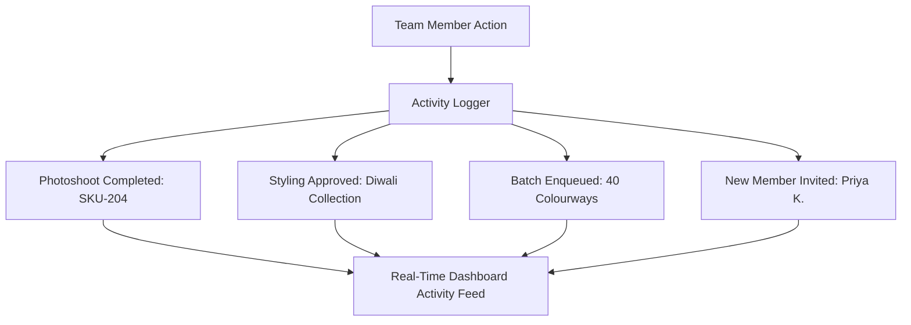

# Recent Activity Feed

The **Recent Activity Feed** on the Dashboard provides a chronological stream of events taking place across your workspace. It keeps cross-functional teams synchronized without requiring endless status meetings.

---

## The Activity Feed Interface

Located in the right column of the main Dashboard:

[SCREENSHOT REQUIRED:
Page: Dashboard (/dashboard)
Exact State: Recent Activity feed showing 8 recent item cards with thumbnails, user avatars, action tags, and relative timestamps ('2 mins ago').
Exact UI Section: Recent Activity feed stream.
Recommended Crop: 480x750
Recommended Dimensions: 480x750
Filename: dashboard-recent-activity-stream.webp]

Each activity card features:
- **Actor**: Avatar and name of the team member who performed the action.
- **Action Badge**: `Generated Shoot`, `Approved Styling`, `Created Plan`, `Exported ZIP`.
- **Target Artifact**: Clickable thumbnail and SKU badge.
- **Timestamp**: Relative time (`Just now`, `14m ago`, `2h ago`).

---

## Quick Actions on Activity Items

Hovering over any activity card reveals context-sensitive shortcut buttons:

[SCREENSHOT REQUIRED:
Page: Dashboard (/dashboard)
Exact State: Hovering over an activity card for 'Photoshoot Generated for YN-LEH-04', revealing action buttons 'View in Studio' and 'Download ZIP'.
Exact UI Section: Hover action buttons on activity card.
Recommended Crop: 420x140
Recommended Dimensions: 420x140
Filename: dashboard-activity-hover-actions.webp]

- **View in Studio**: Opens the completed photoshoot in Studio for full-screen review.
- **Download ZIP**: Exports the assets immediately without leaving the dashboard.
- **Inspect QA**: Opens the quality scorecard if an image was flagged.

---

## Filtering the Feed

Use the mini-filter toggle above the feed:
- **My Activity**: Shows only your own actions and renders.
- **Generations Only**: Filters out administrative events to focus purely on newly produced fashion imagery.
- **All Team Events**: Full organization audit stream.

---

## Next Steps

- Access all historic shoots in [Generation History](/history/overview).
- Configure alert settings in [Notifications](/notifications/overview).
