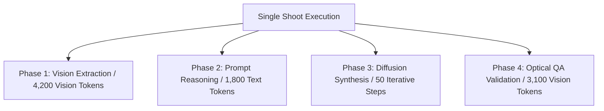

# Token Usage & AI Telemetry

Generating high-fashion commercial imagery involves multiple specialized AI models working in unison: multi-modal vision models for garment analysis, reasoning models for prompt construction, and diffusion pipelines for image synthesis.

The **Token Usage & AI Telemetry** dashboard provides full technical transparency into how tokens and compute steps are consumed across each phase.

---

## The Telemetry Breakdown Card

[SCREENSHOT REQUIRED:
Page: Dashboard (/dashboard)
Exact State: Token Telemetry card open displaying token burn area chart over 14 days, split by Vision Tokens vs Text Tokens.
Exact UI Section: Token Usage & AI Telemetry widget.
Recommended Crop: 900x450
Recommended Dimensions: 900x450
Filename: dashboard-token-telemetry-widget.webp]

---

## Compute Consumption by Phase

<AccordionGroup>
  <Accordion title="1. Multi-Modal Vision Tokens (Analyze Garment)" icon="eye">
    - **Models**: Google Gemini 1.5 Pro / Flash, Qwen-2.5-VL.
    - **Usage**: High-resolution image patching across front, back, and fabric reference photos.
    - **Average Consumption**: 3,500 – 6,000 vision tokens per garment photoshoot.
  </Accordion>

  <Accordion title="2. Creative Direction & Prompt Synthesis" icon="brain">
    - **Models**: OpenAI GPT-4o, Claude 3.5 Sonnet.
    - **Usage**: Synthesizing garment silhouettes, neckline physics, accessory recommendations, and lighting prompts into diffusion-ready positive and negative conditioning embeddings.
    - **Average Consumption**: 1,200 – 2,400 input/output text tokens per 5-pose set.
  </Accordion>

  <Accordion title="3. Generative Diffusion Steps & Latents" icon="sparkles">
    - **Models**: Custom Fine-Tuned FLUX.1 Fashion Latent Models, Meta Muse Spark.
    - **Usage**: Iterative latent denoising, spatial pose alignment (ControlNet / Adapter passes), and 4K latent upscaling.
    - **Average Consumption**: 35 to 50 diffusion steps per image tile.
  </Accordion>

  <Accordion title="4. Automated Quality Assurance Vision Pass" icon="shield-check">
    - **Models**: Specialized Fashion QA Vision Classifier.
    - **Usage**: Validating facial symmetry, anatomical hands, and delta-E color accuracy.
    - **Average Consumption**: 2,500 vision tokens per completed image.
  </Accordion>
</AccordionGroup>

---

## Telemetry Export

Enterprise users can export raw telemetry logs (including prompt hashes, token counts, and GPU latency milliseconds) via CSV or JSON by clicking **Export Telemetry Data** in the top right of the card.

---

## Next Steps

- Translate tokens into monetary spend in [AI Costs & Organization Spend](/dashboard/ai-costs-organization-spend).
- Explore long-term patterns in [14-Day Production Analytics](/dashboard/analytics-14-day).
