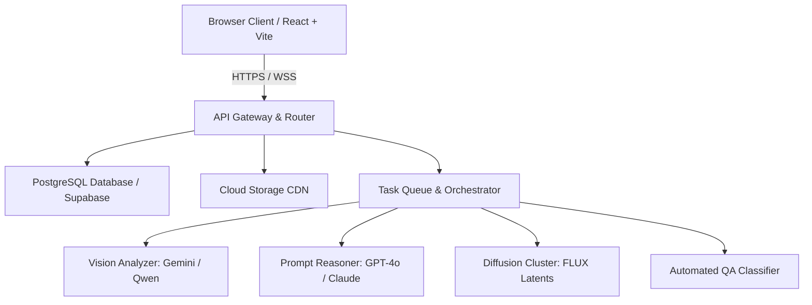

# Architecture Overview

<Note>
This section is intended for software engineers, IT systems integrators, and technical operators integrating Youthnic AI Studio into enterprise ERP or PIM systems. For customer-facing guides, refer to [Getting Started](/getting-started/overview).
</Note>

Youthnic AI Studio is built as a high-performance modern web application paired with an asynchronous distributed AI orchestration backend.

---

## Technology Stack

### Frontend Application
- **Framework**: React 18 with TypeScript and Vite.
- **Styling**: Tailored Vanilla CSS design system with CSS custom properties, dark-mode native tokens, and glassmorphic elevations.
- **Routing & State**: React Router with optimistic state cache and real-time WebSocket subscriptions.
- **Canvas Inspection**: HTML5 Canvas with PanZoom and hardware-accelerated WebGL shader filtering for 4K loupe inspection.

### Backend Infrastructure
- **API Runtime**: Node.js / TypeScript microservices deployed on Google Cloud Run and containerized Docker clusters.
- **Database**: PostgreSQL with row-level security (RLS) policies managed via Supabase.
- **Object Storage**: High-speed cloud object buckets backed by Cloudflare / Cloud CDN edge caching.
- **Message Queue**: Distributed task queue (Redis / BullMQ) handling asynchronous worker job dispatching, automatic retry backoffs, and concurrency rate-limiting.

### Generative AI Pipeline
- **Vision Extraction**: Google Gemini 1.5 Pro / Flash multi-modal vision models.
- **Diffusion Latent Synthesis**: Fine-tuned FLUX.1 latent diffusion models with customized fashion adapters and ControlNet spatial pose guidance.
- **Face & Hand Inpainting**: Secondary latent inpainting models for localized anatomical defect correction.

---

## Next Steps

- Explore programmatic REST access in [API Endpoints](/developer/api-endpoints).
- Review configuration in [Environment Variables](/developer/environment-variables).
