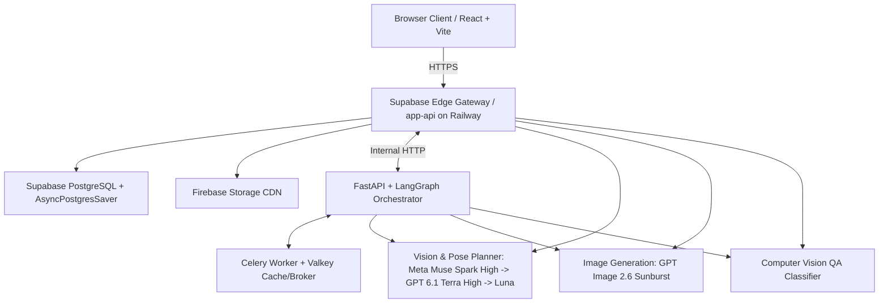

# Architecture Overview

<Note>
This section is intended for software engineers, IT systems integrators, and technical operators integrating Youthnic AI Studio into enterprise ERP or PIM systems. For customer-facing guides, refer to [Getting Started](/getting-started/overview).
</Note>

Youthnic AI Studio is built as a high-performance modern web application paired with an asynchronous distributed AI orchestration backend.

```mermaid
graph TD
    A[Browser Client / React + Vite] -->|HTTPS| B[Supabase Edge Gateway / app-api on Railway]
    B --> C[Supabase PostgreSQL + AsyncPostgresSaver]
    B --> D[Firebase Storage CDN]
    B <-->|Internal HTTP| E[FastAPI + LangGraph Orchestrator]
    E <--> F[Celery Worker + Valkey Cache/Broker]
    B & E --> G[Vision & Pose Planner: Meta Muse Spark High -> GPT 6.1 Terra High -> Luna]
    B & E --> H[Image Generation: GPT Image 2.6 Sunburst]
    B & E --> I[Computer Vision QA Classifier]
```

---

## Technology Stack

### Frontend Application
- **Framework**: React 19 with TypeScript and Vite.
- **Styling**: Tailwind CSS + custom design tokens.
- **Routing & State**: React Router with authenticated Firebase sessions and live Supabase polling.
- **Docs**: Auto-generated from `youthnic-ai-studio-docs/` into `src/features/docs/docsData.ts`.

### Backend Infrastructure (`Railway: AI Studio App`)
- **Edge API Runtime (`functions`)**: Deno Supabase Edge Function `supabase/functions/app-api/` handling auth, RBAC, AI routing (`organization_ai_model_policies`), job scheduling, and Firebase Storage proxying.
- **Agentic Workflow Service (`FastAPI` + `celery-worker`)**: Python FastAPI + LangGraph (`AsyncPostgresSaver` checkpoints) + Product DNA V2 (`/api/v1/dna/extract`, `/api/v1/studio/generate`, `/api/v1/qa/evaluate`), backed by `Valkey` for caching & Celery queuing and configured with scale-to-zero idle sleep (`sleepApplication: true`).
- **Database**: PostgreSQL with row-level security (RLS) managed via Supabase migrations (`dna_versions`, `generation_jobs`, `session_generations`, `planning_assets`, `ai_runs`).
- **Object Storage**: Firebase Storage buckets (`ai-studio-app-be068.firebasestorage.app`).

### Generative AI Pipeline
- **Vision & Pose Extraction**: Meta Muse Spark (`muse-spark-1.2-contributor:high` / `1.3-contributor:high`) primary -> OpenAI **GPT 6.1 Terra** (`gpt-6.1-terra:high`) fallback -> OpenAI Luna (`gpt-5.6-luna`) / Gemini Flash (`gemini-3.8-flash`).
- **Image Synthesis**: OpenAI **GPT Image 2.6 Sunburst** (`gpt-image-2.6-sunburst`, default 3:4 at 2K / `1536x2048`) via `/v1/images/edits` with role-isolated reference manifests and scene locks.
- **Automated CV QA**: Cut-isolated anatomical checks (strictly 2 arms, 2 hands), Farshi 4-inch upper-hem taper verification (strictly isolated to Farshi SKUs), and set continuity validation.

---

## Next Steps

- Explore programmatic REST access in [API Endpoints](/developer/api-endpoints).
- Review configuration in [Environment Variables](/developer/environment-variables).
