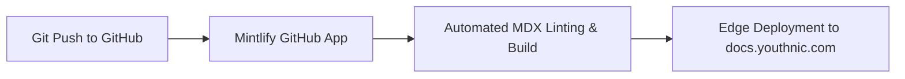

# Deployment Guide

This guide covers deployment procedures for both the **Youthnic AI Studio SaaS Application** and this **Customer Documentation Portal** (`docs.youthnic.com`).

---

## Part 1: Deploying the Documentation Portal (Mintlify)

The documentation lives inside the `youthnic-ai-studio-docs/` repository directory and is natively powered by [Mintlify](https://mintlify.com).



### 1. Local Preview

To test and preview documentation changes locally before pushing:

```bash
# Navigate to the docs folder
cd youthnic-ai-studio-docs

# Install Mintlify CLI globally if not already installed
npm install -g mintlify

# Launch local preview server
mintlify dev
```

The preview server runs at `http://localhost:3333` with hot-reloading.

### 2. Connect GitHub Repository to Mintlify

1. Navigate to the [Mintlify Dashboard](https://dashboard.mintlify.com).
2. Click **Add New Project** and authorize access to `pawanshukla500/aistudio-youthnic`.
3. Set the **Documentation Path** to `/youthnic-ai-studio-docs`.
4. Mintlify will automatically build and deploy every commit pushed to the `main` branch.

### 3. Custom Domain Configuration (`docs.youthnic.com`)

1. In the Mintlify project settings, navigate to **Custom Domain**.
2. Enter `docs.youthnic.com`.
3. In your DNS provider (Cloudflare / Route 53 / GoDaddy), add a CNAME record:
   - **Type**: `CNAME`
   - **Host / Name**: `docs`
   - **Target**: `cname.mintlify.com`
4. SSL certificates are provisioned automatically via Let's Encrypt within 10 minutes.

---

## Part 2: Deploying the Main SaaS Application

The main web application is located in the root repository.

### 1. Production Build Verification

```bash
# Install dependencies
npm install

# Run TypeScript typecheck
npm run typecheck

# Build optimized distribution bundle
npm run build
```

### 2. Containerized Deployment (Google Cloud Run / Docker)

The application can be packaged into a lightweight Alpine Nginx container:

```dockerfile
# Build Stage
FROM node:20-alpine AS build
WORKDIR /app
COPY package*.json ./
RUN npm ci
COPY . .
RUN npm run build

# Serve Stage
FROM nginx:alpine
COPY --from=build /app/dist /usr/share/nginx/html
COPY nginx.conf /etc/nginx/conf.d/default.conf
EXPOSE 80
CMD ["nginx", "-g", "daemon off;"]
```

Build and deploy the container to Google Artifact Registry and Google Cloud Run:

```bash
gcloud builds submit --tag gcr.io/youthnic-prod/aistudio-frontend:latest
gcloud run deploy aistudio-frontend \
  --image gcr.io/youthnic-prod/aistudio-frontend:latest \
  --platform managed \
  --region asia-south1 \
  --allow-unauthenticated
```

---

## Next Steps

- Return to the [Introduction Overview](/introduction/what-is-youthnic-ai-studio).
- Learn about the end-to-end workflow in the [Product Tour](/introduction/product-tour).
