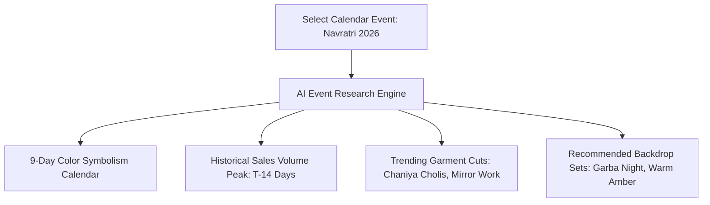

# AI Event Research

Planning a fashion collection for an unfamiliar regional festival can be challenging for national brands. Youthnic AI Studio includes an **AI Event Research Engine** that delivers instant cultural context, commercial buying peaks, color symbolism, and photoshoot styling recommendations for any calendar event.

---

## Triggering AI Event Research

Click any event on your calendar to open the detail drawer, then click **Run AI Research**:

[SCREENSHOT REQUIRED:
Page: Events (/events)
Exact State: Event detail drawer open for 'Navratri 2026' with the 'AI Research' tab active, showing rich research cards for Color Trends, Buying Patterns, and Creative Guidance.
Exact UI Section: AI Event Research drawer view.
Recommended Crop: 550x800
Recommended Dimensions: 550x800
Filename: events-ai-research-navratri.webp]

---

## Insights Generated by AI Research

<AccordionGroup>
  <Accordion title="1. Color Symbolism & Nine-Day Palette" icon="palette">
    For festivals with specific color traditions (such as Navratri's nine sacred colors or Onam's gold-and-white Kasavu palette), the AI outputs the exact sequence of dates, auspicious colors, and recommended fabric shades with hex codes.
  </Accordion>

  <Accordion title="2. Historical Demand & Buying Timeline" icon="chart-line-up">
    Displays the peak shopping window based on past e-commerce velocity:
    - **Browsing & Discovery Window**: Typically 30 to 45 days prior to the festival.
    - **Peak Conversion Window**: 10 to 21 days prior to the festival.
    - **Express Shipping Cutoff**: 5 days prior.
  </Accordion>

  <Accordion title="3. Trending Silhouette & Embellishment Styles" icon="shirt">
    Synthesizes current social media and marketplace trends to identify which garment cuts are gaining popularity (e.g. *"Backless tie-up cholis with multi-colored mirror tassels and flared tiered lehengas"*).
  </Accordion>

  <Accordion title="4. Photoshoot Set & Styling Recommendations" icon="camera">
    Provides ready-to-use creative direction:
    - **Backdrop Environment**: Suggested architecture (e.g. *Festive Fairytale Courtyard with glowing earthen diyas and marigold garlands*).
    - **Lighting Temperature**: Warm amber festive tungsten with soft rim lighting.
    - **Jewellery**: Traditional oxidized silver chokers and jhumkas.
  </Accordion>
</AccordionGroup>

---

## Applying Research to Studio

At the bottom of the AI Research report, click **Apply Styling to Studio**. 

This action automatically pre-seeds the Studio's Creative Direction parameters (model makeup, backdrop set, lighting preset, and accessory recommendations) to match the cultural aesthetics of that specific event.

---

## Next Steps

- Define internal brand dates in [Add Custom Event](/events/add-custom-event).
- Calculate production milestones in [Lead-Time Deadlines](/events/lead-time-deadlines).
