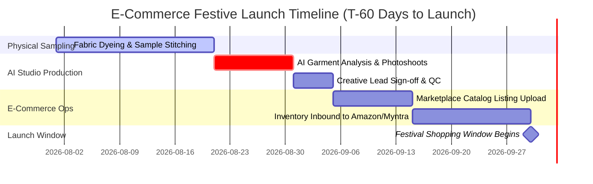

# Production Lead Times & Deadlines

Producing catalog photography is only one link in the e-commerce supply chain. After images are generated, brand teams still require time for listing approvals, catalog copywriting, A+ content creation, inventory inbound shipping, and marketplace review.

Youthnic AI Studio's **Lead-Time Engine** works backward from event launch dates to establish realistic, non-negotiable production deadlines.

---

## Standard Recommended Lead Times

Based on historical marketplace approval cycles, Youthnic recommends the following lead-time buffers:

| Event Scale | Recommended Lead Time | Critical Action Required |
| :--- | :--- | :--- |
| **Marketplace Mega-Sales** (Flipkart BBD, Myntra EORS, Amazon GIF) | **45 – 60 Days Before** | Marketplaces freeze new catalog ingestion 2 to 3 weeks before sale kick-off. Imagery must be live well before traffic surges. |
| **Major Festivals** (Diwali, Eid, Durga Puja) | **30 – 45 Days Before** | Consumer gifting and bridal shopping begins a full month prior. |
| **Regional State Festivals** (Onam, Pongal, Bihu) | **21 – 30 Days Before** | Targeted regional marketing campaigns go live 3 weeks ahead. |
| **Brand Capsule Drops** | **14 – 21 Days Before** | Social media teaser campaigns and lookbook previews. |

---

## Deadline Status Indicators

On both the Calendar and Timeline views, events display real-time deadline status tags:

[SCREENSHOT REQUIRED:
Page: Events (/events)
Exact State: Event detail card for 'Diwali 2026' showing an amber warning badge 'Production Deadline in 8 Days' with remaining lead-time countdown.
Exact UI Section: Event lead-time status widget.
Recommended Crop: 480x220
Recommended Dimensions: 480x220
Filename: events-lead-time-countdown-widget.webp]

- On Schedule: More than 14 days remaining before the recommended catalog production deadline.
- Approaching Deadline: Between 3 and 14 days remaining. Time to trigger sample uploads and batch generation.
- Critical / Behind Schedule: Less than 3 days remaining before the lead-time cutoff. Generating immediately via high-concurrency mode is strongly advised.

---

## Automated Lead-Time Notifications

When an event enters the **Approaching Deadline** window, Youthnic automatically sends alert notifications via email and in-app alerts to assigned merchandisers and creative leads.

---

## Next Steps

- Seed your shoot immediately with [Plan Catalog from Event](/events/plan-catalog-from-event).
- Export your calendar schedule in [Export Calendar](/events/export-calendar).
