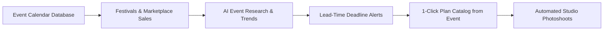

# Events & Marketing Calendar Overview

In the fashion and apparel industry, timing is everything. A festive collection launched two weeks too late can miss peak shopping demand entirely. 

The **Events & Marketing Calendar** (`/events`) in Youthnic AI Studio serves as an intelligent merchandising compass. It combines Indian cultural festivals, pan-India regional holidays, and major e-commerce marketplace sale events with automated catalog lead-time planning.

---

## Core Capabilities

<CardGroup cols={2}>
  <Card title="Multi-Tier Event Database" icon="calendar-star">
    Curated coverage of 150+ national festivals, regional state holidays (Pongal, Durga Puja, Onam, Chhath), and marketplace sales (Myntra EORS, Amazon GIF, Flipkart BBD).
  </Card>
  <Card title="AI Event Research" icon="brain">
    Automated intelligence that surfaces peak buying windows, high-demand garment categories, trending color palettes, and regional consumer preferences.
  </Card>
  <Card title="Production Lead-Time Tracking" icon="hourglass-half">
    Calculates the exact date your catalog photoshoot must be completed to allow for sampling, marketplace listing approval, and warehouse inventory staging.
  </Card>
  <Card title="1-Click Catalog Seeding" icon="wand-magic-sparkles">
    Convert any event directly into a pre-configured catalog campaign with festive styling, appropriate backdrops, and target delivery dates pre-populated.
  </Card>
</CardGroup>

---

## The Events Workspace

Navigate to **Events** (`/events`) from the primary navigation:

<Frame caption="Live Campaign Intelligence & Events Roadmap — showing 35 Events in View, Prep Deadlines, Gemini Research Controls, and Event Cards for Ganesh Chaturthi & Flipkart Big Billion Days">
  
</Frame>

The interface is structured into:
- **Campaign Intelligence Metrics**: Live counter badges for **Events in View** (35 next 12 months), **Next Event** countdown (e.g. Ganesh Chaturthi in 3 days), **Prep Due &le; 14 Days** (17 upcoming deadlines), **Festivals** (12 covering 26 states), and **Marketplace Sales** (9 mega-events).
- **Intelligence Actions**: 1-click **Refresh research (Gemini)** and **Seed state & marketplace calendar** to automate date discovery and consumer search sentiment.
- **Filter & View Switcher**: Filter by horizon (Next 12 months), type, state, and marketplace, with toggles between **Timeline**, **Cards**, and **Table** modes.
- **Urgent Prep Cards**: Cards with dated prep deadlines, regional coverage, marketplace channels, mood backdrops, and direct **Plan catalog** conversion buttons.

---

## Next Steps

- Explore view modes in [Calendar Views](/events/calendar-views).
- Learn about [Event Types & State Coverage](/events/event-types-states).
- Use [AI Event Research](/events/ai-event-research) to uncover seasonal trends.
