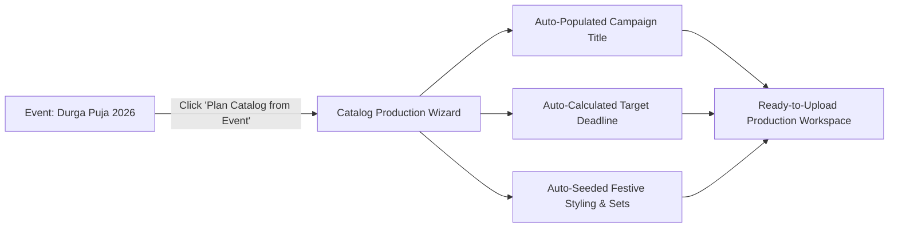

# Plan Catalog from Event

Rather than manually creating a catalog campaign and re-typing campaign titles, dates, target marketplaces, and festive backdrops from scratch, you can seed a complete production workspace with a single click using **Plan Catalog from Event**.

---

## The 1-Click Launch Action

Open any event's detail drawer and click the prominent **Plan Catalog from Event** action button:

[SCREENSHOT REQUIRED:
Page: Events (/events)
Exact State: Event detail drawer open for 'Durga Puja 2026' highlighting the primary action button 'Plan Catalog from Event'.
Exact UI Section: Event detail drawer bottom action bar.
Recommended Crop: 500x180
Recommended Dimensions: 500x180
Filename: events-plan-catalog-action-button.webp]

---

## What Gets Pre-Populated

When you initialize a campaign from an event, Youthnic AI Studio automatically configures:

<CardGroup cols={2}>
  <Card title="Campaign Title & Code" icon="heading">
    Named systematically after the event (e.g. *"Durga Puja 2026 Festive Saree Collection"* / Prefix: `DP26-SR`).
  </Card>
  <Card title="Target Production Deadline" icon="calendar-check">
    Set automatically to the recommended lead-time completion date (e.g. 30 days before the festival begins).
  </Card>
  <Card title="Festive Architectural Backdrop" icon="landmark">
    Pre-selects an authentic environment (e.g. *Traditional Kolkata Heritage Courtyard with Terracotta Architecture*).
  </Card>
  <Card title="Curated Styling & Props" icon="sparkles">
    Pre-tunes jewellery to traditional regional styles (e.g. *Intricate Gold Filigree Chokers and Red Shakha Pola Bangles*).
  </Card>
</CardGroup>

---

## Confirming and Uploading Garments

[SCREENSHOT REQUIRED:
Page: Catalog Production (/planning?tab=catalogs)
Exact State: Newly created catalog campaign workspace opened, pre-populated with Durga Puja settings, ready for SKU colourway drops.
Exact UI Section: Pre-populated catalog hub.
Recommended Crop: 1200x650
Recommended Dimensions: 1200x650
Filename: events-prepopulated-catalog-hub.webp]

<Steps>
  <Step title="Review Pre-Populated Fields">
    Verify the campaign title, credit budget cap, and target marketplaces in the modal.
  </Step>
  <Step title="Click Launch Catalog Hub">
    Click **Confirm & Open Catalog**. You are redirected to the [Catalog Production](/catalog-production/overview) workspace.
  </Step>
  <Step title="Add SKUs & Garment References">
    Add your product colourways or upload a CSV spreadsheet. All items inherit the event's festive creative direction automatically.
  </Step>
</Steps>

---

## Next Steps

- Share calendar plans across your organization with [Export Calendar](/events/export-calendar).
- Track the campaign alongside other seasonal drops in [Planning](/planning/overview).
