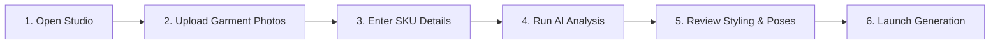

# Create Your First AI Photoshoot

Producing your first commercial-grade fashion photoshoot in Youthnic AI Studio takes under five minutes. This guide walks you through the initial configuration, garment photo uploads, AI garment analysis, and launching the five-pose photoshoot.

---

## Before You Begin

Before starting, ensure you have:
1. An active Youthnic account with the **Member** or **Admin** role.
2. At least one high-resolution front garment photo on a plain background or mannequin.
3. Your internal SKU code or style number (e.g., `YN-ANARKALI-001`).

<Tip>
For best results, review the [Recommended Product Images](/getting-started/recommended-product-images) guide to ensure your source photos have even lighting and crisp fabric detail.
</Tip>

---

## Step 1: Open the Studio Workspace

Navigate to **Studio** from the primary sidebar or top navigation bar. 

[SCREENSHOT REQUIRED:
Page: Studio (/studio)
Exact State: Empty studio workspace ready for input.
Exact UI Section: Top header with SKU input, preset picker, and empty upload slots.
Recommended Crop: 1920x450 top half of Studio.
Recommended Dimensions: 1200x280
Filename: studio-empty-header.webp]

You will see the studio header containing:
- **SKU Code**: Identifier for asset organization and catalog exports.
- **Product Name**: Commercial title for marketplace sync.
- **Category & Subcategory**: Garment classification (e.g., *Ethnic Wear > Anarkali Suit*).
- **Target Marketplace**: Preset aspect ratios and framing standards (Amazon, Myntra, Nykaa, Ajio, Shopify).

---

## Step 2: Upload Reference Garment Photos

In the **Product Photos** panel on the left, upload your reference images. Drag and drop files directly or click each tile to select.

[SCREENSHOT REQUIRED:
Page: Studio (/studio)
Exact State: Front and back images uploaded, showing green check badges.
Exact UI Section: Product Photos card with labeled slots (Front, Back, Fabric Detail).
Recommended Crop: 600x700 left panel.
Recommended Dimensions: 600x700
Filename: studio-product-photos-uploaded.webp]

<Steps>
  <Step title="Upload Front View (Mandatory)">
    Drop your primary front image into the **Front Reference** card. Set the role dropdown to `Front`. This image defines the neckline, embroidery, silhouette, and front drape.
  </Step>
  <Step title="Upload Back View (Recommended)">
    Drop the back image into the **Back Reference** card. This informs the model's rear styling, back zipper, tie-up tassles, and deep back cuts.
  </Step>
  <Step title="Upload Fabric & Texture Detail (Optional but High Value)">
    Upload a 1:1 macro shot of the weave, embroidery, or zari work into the **Fabric / Pattern** slot. This locks yarn texture and specular sheen into the generator.
  </Step>
</Steps>

<Note>
If you are shooting an Indian ethnic saree, activate the **Saree Mode** toggle to reveal dedicated slots for the *Pallu*, *Pleats*, and *Blouse Piece*.
</Note>

---

## Step 3: Run AI Product Analysis

Once your photos are in place, click the **Analyze Garment** button at the top right of the Product Photos card.

[VIDEO REQUIRED:
Video ID: VID-STUDIO-001
Title: Garment Upload and AI Vision Extraction
Duration: 18 seconds
Start State: Studio page with two uploaded photos.
Actions: Click 'Analyze Garment', show pulsing loading spinner across photo cards, show Product Identity card populating with detected attributes (fabric, color, silhouette, neckline).
End State: Product Identity Profile fully populated with 100% confidence badges.
Suggested Filename: studio-analyze-garment.mp4
Narration Required: No]

Youthnic's dual-engine vision analyzer inspects the images to generate the **Product Identity Profile**:
- **Garment Silhouette**: A-line, straight cut, flared, tiered, or mermaid.
- **Fabric Type & Weight**: Silk georgette, cotton cambric, velvet, organza, crepe.
- **Color Palette**: Hex codes and primary undertones extracted directly from the cloth.
- **Neckline & Sleeve Treatment**: Sweetheart neck, boat neck, elbow sleeves with gotta patti.
- **Embellishments**: Zari embroidery, thread work, mirror accents, digital print.

<Warning>
Always inspect the detected **Primary Color** chip. If ambient studio lighting distorted the color (e.g., warm tungsten making ivory look yellow), click the color swatch to adjust the target hex value before generating.
</Warning>

---

## Step 4: Configure Creative Direction & Styling

Scroll to the **Creative Direction** and **Model Selection** cards.

[SCREENSHOT REQUIRED:
Page: Studio (/studio)
Exact State: Model identity card showing selected model 'Aanya (Indian/South Asian)' and backdrop setting 'Minimalist Jaipur Palace Courtyard'.
Exact UI Section: Creative Direction & Model Selection cards side by side.
Recommended Crop: 1200x500 middle section.
Recommended Dimensions: 1200x500
Filename: studio-creative-model-selection.webp]

<Tabs>
  <Tab title="Model Identity">
    Choose from your saved AI model identities or pick a standard platform persona:
    - **Demographic & Ethnicity**: Indian, South Asian, Middle Eastern, Western, East Asian.
    - **Age Bracket**: 20s young contemporary, 30s luxury bridal, 40s classic elegant.
    - **Hair & Makeup**: Dewy festive makeup, editorial matte, sleek bun, soft beach curls.
  </Tab>
  <Tab title="Styling & Accessories">
    Configure complementary elements that will not overpower the product:
    - **Jewellery**: Kundan choker, polki studs, minimal oxidized silver, or contemporary diamond solitaires.
    - **Footwear**: Embellished juttis, metallic block heels, strappy stilettos.
    - **Drape & Dupatta**: Left shoulder pinned, cascading open drape, wrist drape.
  </Tab>
  <Tab title="Set & Lighting">
    Select an architectural environment:
    - *Minimalist Sunlit Studio* (Clean neutral e-commerce background)
    - *Archways & Lime Plaster Courtyard* (Warm luxury festive)
    - *Contemporary High-Ceiling Penthouse* (Modern fusion ethnic)
  </Tab>
</Tabs>

---

## Step 5: Review the Five-Pose Catalog Plan

Youthnic automatically pre-configures a balanced 5-shot e-commerce editorial plan based on the detected garment type:

[SCREENSHOT REQUIRED:
Page: Studio (/studio)
Exact State: Five-Pose Catalog Plan accordion expanded showing cards for Poses 1 through 5.
Exact UI Section: Five-Pose Catalog Plan card with pose thumbnails and toggle switches.
Recommended Crop: 1200x420 lower section of Studio.
Recommended Dimensions: 1200x420
Filename: studio-five-pose-plan.webp]

1. **Pose 1 — Front Hero**: Full body upright standing shot, centered framing, direct eye contact.
2. **Pose 2 — Three-Quarter Angle**: 45-degree rotation showing side silhouette and garment depth.
3. **Pose 3 — Rear Back View**: Complete back view. Dupatta is draped forward across the shoulder to prevent obscuring back neck ties or embroidery.
4. **Pose 4 — Creative / Seated Editorial**: Context-aware dynamic posture. If your style reference or prompt requires a relaxed lifestyle aesthetic, the model is seated on a carved teak settee; otherwise, a fluid movement walking pose is selected.
5. **Pose 5 — Macro Close-Up**: Waist-up or chest-up crop focusing on textile weave, buttons, and neckline borders.

---

## Step 6: Launch Generation & Monitor Output

Click **Generate Photoshoot** (5 Credits) at the top right sticky bar.

[SCREENSHOT REQUIRED:
Page: Studio (/studio)
Exact State: Photoshoot generation in progress showing 3 out of 5 images completed with live generation spinners on 4 and 5.
Exact UI Section: Right-hand results canvas with 5 grid tiles.
Recommended Crop: 1200x800 main canvas.
Recommended Dimensions: 1200x800
Filename: studio-generation-in-progress.webp]

The generation pipeline takes approximately 45–75 seconds to render all 5 images concurrently. As each shot completes:
- Automated **Quality Validation** verifies facial symmetry, garment edge coherence, and color fidelity.
- Images render directly in your Studio review grid.

---

## Next Steps

Now that you know how to configure a single shoot:
- Deep dive into the [First Generation Walkthrough](/getting-started/first-generation-walkthrough) to learn how to review, regenerate, and download high-resolution assets.
- Explore [Reference Roles](/studio/reference-roles) to unlock multi-piece lehenga and saree workflows.
- Scale up to multi-colorway shoots with [Catalog Production](/catalog-production/overview).
