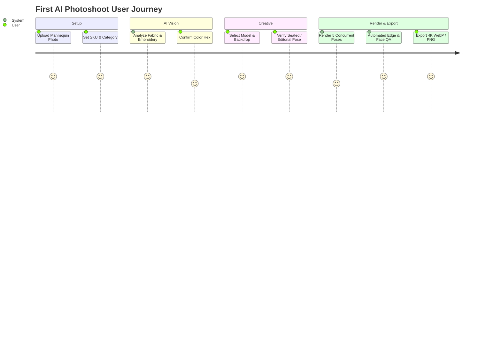

# First Generation Walkthrough

In this comprehensive walkthrough, we will produce a full 5-pose commercial catalog shoot for an **Embroidered Chanderi Silk Kurta Set** (SKU: `CK-SILK-204`). 

Follow this end-to-end guide to see how Youthnic AI Studio handles realistic fabric drape, intricate zari borders, and marketplace-compliant composition.



---

## 1. Project Specifications

| Attribute | Specification |
| :--- | :--- |
| **Garment Type** | 3-Piece Kurta Set (Kurta, Cigarette Pants, Organza Dupatta) |
| **Fabric** | Dusty Rose Chanderi Silk with Zari Gotapatti |
| **Source Photo** | Mannequin shot against gray studio backdrop |
| **Model Aesthetic** | Contemporary South Asian, warm undertone, 5'9" frame |
| **Backdrop** | Neutral Warm Limestone Gallery with soft directional daylight |
| **Output Format** | 2048 x 2560 px (4:5 Aspect Ratio for Myntra/Nykaa) |

---

## 2. Uploading Source References

Open **Studio** (`/studio`) and drop the mannequin front photo into the primary upload card.

[SCREENSHOT REQUIRED:
Page: Studio (/studio)
Exact State: Mannequin photo loaded into Front Reference card with SKU input 'CK-SILK-204'.
Exact UI Section: Product Photos card with single front reference loaded.
Recommended Crop: 650x550
Recommended Dimensions: 650x550
Filename: walkthrough-front-mannequin-uploaded.webp]

<Steps>
  <Step title="Assign Front Role">
    Click the role selector below the thumbnail and select **Front**. This confirms to the model that the visible neckline cut, front placket buttons, and hem embroidery represent the true front of the garment.
  </Step>
  <Step title="Add Dupatta & Border Reference">
    Drop a secondary photo into the **Fabric / Pattern** slot focusing specifically on the scallop-cut zari border of the organza dupatta.
  </Step>
  <Step title="Select Output Preset">
    From the top right preset dropdown, choose **Myntra Standard (4:5)**. This locks the framing parameters to ensure proper head-to-toe headroom.
  </Step>
</Steps>

---

## 3. Running AI Vision Extraction

Click **Analyze Garment**. In 6 seconds, the vision pipeline extracts the full technical spec:

[SCREENSHOT REQUIRED:
Page: Studio (/studio)
Exact State: AI Product Analysis completed. Identity card displaying extracted JSON/chips.
Exact UI Section: Product Identity Profile card showing fabric chips, color palette, and neckline badges.
Recommended Crop: 700x600
Recommended Dimensions: 700x600
Filename: walkthrough-analysis-extracted.webp]

```json
{
  "silhouette": "Straight Fit Knee-Length Kurta",
  "primary_fabric": "Chanderi Silk with woven sheen",
  "dupatta_fabric": "Sheer Silk Organza with scalloped gota border",
  "primary_color": "#D8A49B", // Dusty Rose Pink
  "accent_color": "#E6C687", // Antique Dull Gold Zari
  "neckline": "Split V-Neck with Mandarin Collar",
  "sleeve_length": "Three-Quarter Sleeves with Scallop Cuffs"
}
```

<Tip>
Notice how the AI identified the difference between the opaque Chanderi silk of the kurta body and the translucent sheer quality of the organza dupatta. This ensures the generated images render realistic translucency when draped over the model's arms.
</Tip>

---

## 4. Selecting Model Persona & Lighting Set

Switch to the **Model & Scene** tab:

[SCREENSHOT REQUIRED:
Page: Studio (/studio)
Exact State: Model persona 'Tara' active, lighting set to 'Soft Daylight Studio'.
Exact UI Section: Creative Direction split-panel.
Recommended Crop: 900x500
Recommended Dimensions: 900x500
Filename: walkthrough-model-scene-selection.webp]

1. **Model Persona**: Select **Tara** (Indian, natural makeup, soft center-parted hair bun).
2. **Jewellery Selection**: Toggle **Minimal Polki**. The system will render small teardrop polki earrings without heavy neckpieces that would obstruct the neckline embroidery.
3. **Footwear**: Select **Gold Muted Kolhapuri Wedges**.
4. **Environment**: Choose **Minimalist Warm Beige Studio** with subtle cast architectural shadows.

---

## 5. Reviewing the 5-Pose Catalog

Expand the **Five-Pose Catalog Plan** card:

[SCREENSHOT REQUIRED:
Page: Studio (/studio)
Exact State: 5 pose cards visible with pose descriptions and prompt summaries.
Exact UI Section: Pose configuration strip.
Recommended Crop: 1200x350
Recommended Dimensions: 1200x350
Filename: walkthrough-pose-cards-strip.webp]

- **Pose 1 (Front Hero)**: Model standing tall, hands relaxed by side, garment hanging naturally to display hemline balance.
- **Pose 2 (Three-Quarter)**: Model rotated 45 degrees, revealing sleeve fit and trouser profile.
- **Pose 3 (Rear View)**: Model standing facing away, head turned slightly profile. Dupatta is draped over the left shoulder and brought forward so the back kurta structure is visible.
- **Pose 4 (Editorial Walking)**: Model captured mid-stride, showcasing the natural drape and movement of the organza dupatta in motion.
- **Pose 5 (Close-Up)**: Framing from collarbone to waist, highlighting the crisp embroidery on the split V-neck and collar.

---

## 6. Rendering and Real-Time QA

Click **Generate Photoshoot**.

[VIDEO REQUIRED:
Video ID: VID-STUDIO-002
Title: Generation Progress and Real-Time QA Inspection
Duration: 25 seconds
Start State: Generation launched with 5 empty tiles pulsing.
Actions: Watch tile 1 complete, automated QA badge turns green ('Passed - Score 98/100'). Tile 2 and 3 complete in parallel. Click into tile 1 to open 4K inspection modal.
End State: 5 finished high-fashion shots on canvas.
Suggested Filename: walkthrough-generation-realtime-qa.mp4
Narration Required: No]

As the photos render, Youthnic's automated quality guardrails run three verification passes:
1. **Garment Integrity Check**: Compares detected embroidery patterns against the original reference photo.
2. **Anatomical Coherence**: Validates fingers, palms, eyes, and posture symmetry.
3. **Lighting & Palette Match**: Confirms the output color gamut matches `#D8A49B` within delta-E tolerance.

---

## 7. Inspecting and Downloading Finished Images

Once all 5 poses are complete, hover over any tile to open the full-screen inspection lightbox:

[SCREENSHOT REQUIRED:
Page: Studio (/studio)
Exact State: Fullscreen modal showing high-res 4K image with zoom loupe active over embroidery.
Exact UI Section: Lightbox zoom modal.
Recommended Crop: 1200x850
Recommended Dimensions: 1200x850
Filename: walkthrough-lightbox-inspection.webp]

<Tabs>
  <Tab title="Download Individual File">
    Click the **Download** button in the top right of the lightbox to export a lossless PNG or optimized 4K WebP image.
  </Tab>
  <Tab title="Bulk Export ZIP">
    Click **Export All Assets (.ZIP)** on the studio action bar to download all 5 poses cleanly renamed using your SKU:
    - `CK-SILK-204_01_hero.webp`
    - `CK-SILK-204_02_three-quarter.webp`
    - `CK-SILK-204_03_back.webp`
    - `CK-SILK-204_04_editorial.webp`
    - `CK-SILK-204_05_detail.webp`
  </Tab>
  <Tab title="Regenerate Single Pose">
    If Pose 4 needs a seated variation instead of walking, click **Regenerate**, adjust the prompt to *"Model seated gracefully on sandstone block"*, and re-render only Pose 4 for 1 credit.
  </Tab>
</Tabs>

---

## Tutorial Video

[VIDEO TUTORIAL REQUIRED:
Title: Complete First Photoshoot Walkthrough
Duration: 3 minutes 30 seconds
Include:
- Navigating to Studio
- Dragging mannequin photos
- Setting SKU and category
- AI vision extraction review
- Selecting model and set lighting
- Inspecting five-pose parameters
- Launching generation
- Zooming into fabric textures
- Downloading ZIP bundle
Suggested Filename: tutorial-first-photoshoot-walkthrough.mp4]

---

## Next Steps

Congratulations on completing your first AI photoshoot! Explore deeper workflows:
- [Studio Reference Roles](/studio/reference-roles) for lehenga drapes, bottom-wear, and style references.
- [Creative Direction](/studio/creative-direction) for custom backdrops and brand aesthetic locking.
- [Batch Catalog Production](/catalog-production/overview) to shoot 50+ colorways automatically.
