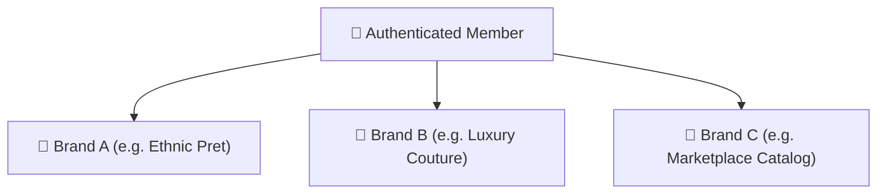

# Login & Access

Youthnic AI Studio provides enterprise authentication powered by Firebase Auth, supporting standard email/password authentication, Google single sign-on (SSO), and multi-tenant organization switching.

---

## Signing In

<Steps>
  <Step title="Navigate to the Studio URL">
    Open your web browser and navigate to your company's Youthnic AI Studio portal (e.g. `https://aistudio.youthnic.com` or local dev instance).
  </Step>
  <Step title="Enter Your Credentials">
    Choose your preferred authentication method on the login card:
    - **Email and Password**: Enter your registered corporate email and password, then click **Sign In**.
    - **Google SSO**: Click **Continue with Google** to authenticate with your company G Suite or Google Workspace account.
  </Step>
  <Step title="Two-Factor Authentication (If Enforced)">
    If your organization enforces multi-factor authentication, complete the verification prompt on your authenticator app or mobile device.
  </Step>
</Steps>

[SCREENSHOT REQUIRED:
Route: `/login`
Capture: Centered authentication card showing email/password inputs, Google SSO button, and brand styling.
Target Filename: `images/getting-started/login-screen.webp`]

---

## Workspace & Organization Switching

Youthnic AI Studio is built with multi-tenant enterprise support. Users who collaborate across multiple brands, subsidiaries, or sister agencies can switch between workspaces seamlessly without logging out.

### How to Switch Organizations
1. Look at the top-right corner of the application navigation bar.
2. Click the **Organization Dropdown** menu (displays your current active brand).
3. Select your target organization from the list.
4. The application context, active planning batches, permissions, and history instantly update to the selected tenant.

<Note>
Each organization maintains isolated planning batches, reference assets, AI budget caps, and team memberships. Data is never shared across organization boundaries.
</Note>

---

## Password Reset & Account Recovery

If you forget your password:
1. On the login screen, click **Forgot your password?**.
2. Enter your registered email address and click **Send Reset Link**.
3. Check your email inbox for the reset link issued by `noreply@youthnic.com`.
4. Follow the link to choose a new strong password (minimum 8 characters with numbers and special symbols).

---

## Access Permissions & Error States

If you sign in and see a message stating:
> *"Access Denied: You do not have permission to view this page."*

Your user account has not yet been assigned functional roles by your organization administrator. Contact your internal Administrator or Team Lead to grant one of the following baseline permissions:
- `studio.view` & `studio.create`: Required to access and generate single-SKU photoshoots in Studio.
- `planning.view`: Required to access the Planning Roadmap and Catalog Production boards.
- `reports.view`: Required to access Dashboard analytics.

---

## Next Steps

<Card title="Explore the Application Interface" icon="window-maximize" href="/getting-started/understanding-the-interface">
  Learn how to navigate the top bar, sidebar, and workspace tools.
</Card>
