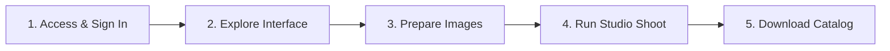

# Getting Started Overview

Welcome to Youthnic AI Studio. This guide will walk you through setting up your account, understanding the interface, and generating your very first professional AI photoshoot in under 5 minutes.

---

## The First-Time User Journey

Follow these five simple milestones to become productive immediately:

<CardGroup cols={2}>
  <Card title="1. Sign In & Access" icon="right-to-bracket" href="/getting-started/login-access">
    Learn how authentication works, how to switch between company workspaces, and how permissions are assigned.
  </Card>
  <Card title="2. Interface Tour" icon="window-maximize" href="/getting-started/understanding-the-interface">
    Familiarize yourself with the global sidebar, breadcrumbs, organization switcher, and notifications.
  </Card>
  <Card title="3. Image Guidelines" icon="image" href="/getting-started/recommended-product-images">
    Review recommended photo angles, lighting conditions, and file resolutions to ensure maximum garment fidelity.
  </Card>
  <Card title="4. Create Your First Shoot" icon="wand-magic-sparkles" href="/getting-started/create-first-photoshoot">
    Step-by-step instructions to upload references, analyze the garment, and review creative styling.
  </Card>
</CardGroup>

---

## Quick Reference Checklist

Before launching your first generation, verify you have:
- [ ] An active user account with `studio.view` and `studio.create` permissions.
- [ ] Clear front and back photographs of your apparel product (flat-lays, mannequin shots, or supplier photos are all accepted).
- [ ] A fabric detail close-up (recommended for textured weaves, embroidery, or metallic prints).
- [ ] For two-piece sets: a clear photo of the bottom wear (pants, farshi pajama, or skirt).
- [ ] An idea of your preferred creative aesthetic (or an optional **Style Reference** photo).

---

## Recommended Next Step

Start by logging into your organization workspace:
[Login & Access Guide &rarr;](/getting-started/login-access)
