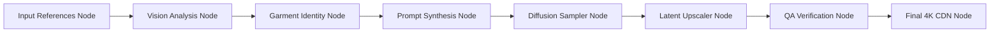

# Inspect Generation Flow

For creative directors, technical merchandisers, and platform administrators, Youthnic AI Studio provides the **Generation Flow Inspector** (`/history/flow/:jobId`). 

This tool visualizes the complete generative execution graph as an interactive Directed Acyclic Graph (DAG), showing every intermediate transform from raw pixel inputs to final upscale.

---

## Navigating the Flow Graph

To access the flow inspector, open any generation in History and click **Inspect Pipeline Flow**:

[SCREENSHOT REQUIRED:
Page: Generation History (/history/flow/:jobId)
Exact State: Interactive node graph displayed on canvas showing interconnected nodes with green execution checkmarks and execution duration badges.
Exact UI Section: Fullscreen Flow DAG canvas.
Recommended Crop: 1920x950
Recommended Dimensions: 1400x690
Filename: history-flow-dag-inspector.webp]

---

## What Each Node Reveals

Click on any node in the graph to inspect its inputs, outputs, and execution telemetry in the right-side inspector panel:

<AccordionGroup>
  <Accordion title="1. Input References Node" icon="images">
    Shows raw uploaded files, detected aspect ratios, color spaces, and assigned semantic reference roles (`front`, `back`, `fabric_pattern`).
  </Accordion>

  <Accordion title="2. Vision Extraction Node" icon="eye">
    Displays the multi-modal vision prompt and raw JSON taxonomy extracted by Gemini or Qwen (fabric weight, collar type, hex palette).
  </Accordion>

  <Accordion title="3. Conditioning & Pose Guidance Node" icon="person">
    Displays the depth maps, normal maps, and openpose skeleton keypoints used to guide the model's limbs and garment hemline drop.
  </Accordion>

  <Accordion title="4. Diffusion Latents Node" icon="sparkles">
    Displays the initial random noise seed, step progression (1 to 50), and CFG scale curve.
  </Accordion>

  <Accordion title="5. Optical QA Scorecard Node" icon="shield-check">
    Displays raw confidence scores for hand anatomy, eye geometry, and delta-E color distance calculations.
  </Accordion>
</AccordionGroup>

---

## Debugging Pipeline Errors

If a historical photoshoot exhibited an unexpected visual anomaly:
1. Open the Flow Graph.
2. Locate the node highlighted with an amber or red badge.
3. Inspect the **Error Log** tab to see whether the issue originated from poor source photo resolution, an ambiguous vision prompt, or upstream GPU throttling.

---

## Next Steps

- Export previous shoots in [Download Images & ZIP](/history/download-images-zip).
- Troubleshoot failed jobs in [Failed Generations & Retry](/history/failed-generations-retry).
