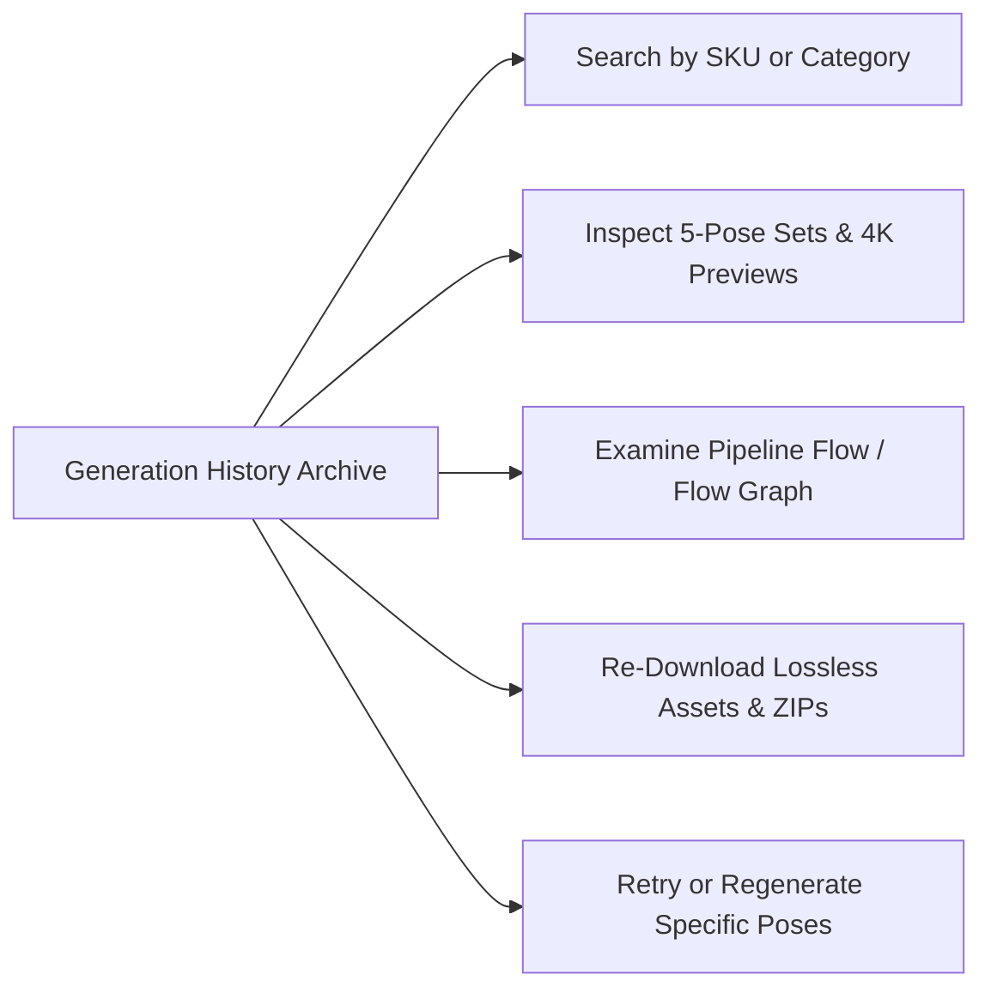

# Generation History Overview

Every photoshoot generated in Youthnic AI Studio is permanently preserved in your organization's cloud repository. The **Generation History** (`/history`) interface provides a searchable, filterable archive of every image, prompt variation, reference photo, and quality validation report.

---

## Core Capabilities

<CardGroup cols={2}>
  <Card title="Zero-Credit Re-Downloads" icon="cloud-arrow-down">
    Assets never expire. Re-download full-resolution 4K WebP or JPEG packages months after initial generation without consuming any additional credits.
  </Card>
  <Card title="Visual Flow Inspector" icon="diagram-project">
    Open the `/history/flow/:jobId` node graph to examine every step of the generation pipeline—from raw reference embeddings to final QA scores.
  </Card>
  <Card title="Side-by-Side Comparison" icon="split">
    Compare generated images directly against original physical garment references to verify embellishment fidelity and fabric drape.
  </Card>
  <Card title="Audit & Credit Accounting" icon="receipt">
    View the exact timestamp, initiating user, model provider, and credit ledger deduction for every historical generation job.
  </Card>
</CardGroup>

---

## The History Workspace Layout

Navigate to **History** (`/history`) from the primary navigation bar:

<Frame caption="Live Generation Archive on Youthnic AI Studio History — showing Saree 5-Pose Production Set (Frontal, Three-Quarter, Rear Back View, Editorial Seated, Fabric Texture Closeup), Tokens, and Dollar Costs">
  
</Frame>

The interface includes:
- **Search & Filter Bar**: Search by SKU code (e.g. `saree`), prompt keywords, generation source (`All Sources`), and completion status (`All generations`).
- **Session Header & Actions**: Displays SKU status (`COMPLETED`), completion rate (`5/5 images stored - 100%`), aspect ratio (`3:4`), resolution (`2K`), quality tier (`medium`), author, timestamp, and instant action buttons: **View references**, **Clone Session**, and **Download ZIP**.
- **Per-Pose Economic Telemetry**: Granular visibility into input/output token consumption and authoritative per-pose dollar cost (e.g., Head-to-Toe Frontal: $0.3605, Pallu Fall: $0.1976, Closeup: $0.3858).
- **Batch Export Bar**: Quick export to losslessly compressed ZIP archives ready for marketplace publishing.

---

## Next Steps

- Explore past shoots in [View Past Generations](/history/view-past-generations).
- Inspect the AI pipeline in [Inspect Generation Flow](/history/inspect-generation-flow).
- Export assets in [Download Images & ZIP](/history/download-images-zip).
