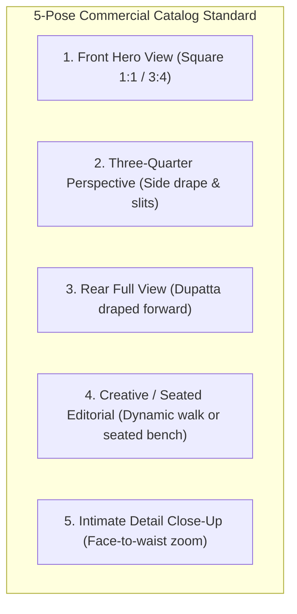

# Main Capabilities

Youthnic AI Studio combines proprietary fashion prompt compilers, multi-model vision routing, and enterprise workflow management to deliver an all-in-one AI photoshoot studio.

---

## 1. Multi-Reference Product Grounding

Unlike generic text-to-image or single-image tools, Youthnic AI Studio accepts up to **8 specialized image reference roles** per photoshoot:

<CardGroup cols={2}>
  <Card title="Front & Back Garment Authority" icon="arrows-left-right">
    Upload direct front and back product shots. The front image dictates front yoke construction, while the back image serves as the sole authority for rear necklines, back embroidery, and closures.
  </Card>
  <Card title="Dedicated Bottom-Wear Authority" icon="socks">
    Upload a separate bottom wear photo (e.g. farshi pajama or sharara). The AI locks the cut, volume, gathers, and metallic bootas onto the bottom panels without bleeding upper kurta prints.
  </Card>
  <Card title="Fabric & Microtexture Close-Ups" icon="magnifying-glass">
    Pixel-level fabric close-ups supply exact weave geometry, embroidery thread shine, and pattern density to the vision compiler.
  </Card>
  <Card title="Model Identity & Style Anchors" icon="user-check">
    Upload a single model face reference and style reference image. The AI locks model bone structure and studio backdrop across all angles while completely ignoring supplier pre-shoot clutter.
  </Card>
</CardGroup>

---

## 2. The 5-Pose Commercial Catalog Standard

Every product photoshoot generates a cohesive 5-image contact sheet designed to satisfy top e-commerce marketplace requirements:

<Tabs>
  <Tab title="Pose 1: Front Hero">
    **Square, unobstructed head-to-toe hero view.** Establishes the model identity, facial expression, hair styling, footwear, studio backdrop, and lighting temperature for the entire shoot.
  </Tab>
  <Tab title="Pose 2: 3/4 Perspective">
    **Product-appropriate angled framing.** Displays side construction, fabric hang, side slit depth, and silhouette fluidity from a dynamic three-quarter orientation.
  </Tab>
  <Tab title="Pose 3: Rear View">
    **True 100% rear view.** Shoulders and hips face fully away. Dupatta or shawl is draped forward over both arms or held in front so the entire rear garment (neckline, back panel, embroidery, and hem) is 100% visible and unobstructed.
  </Tab>
  <Tab title="Pose 4: Creative / Seated">
    **Conditional Editorial Pose.** If your style reference or product notes call for sitting, the model is elegantly seated on a minimal studio bench, step, or architectural plinth, keeping bottom-wear volume and footwear completely visible and unbunched. Otherwise, captures dynamic walking or swirl movement.
  </Tab>
  <Tab title="Pose 5: Detail Close-Up">
    **Genuine zoomed-in face-to-waist crop.** Pairs a photorealistic, natural Gen-Z facial expression with a sharp, high-magnification view of the garment's primary selling feature (neckline embroidery, print, or weave).
  </Tab>
</Tabs>

---

## 3. Garment Truth Contract & Absence Locks

To prevent hallucinations, the platform creates an immutable **Garment Truth Contract** during analysis:

- **Regional Provenance**: Every detail (buttons, tassels, borders, slits) must be visibly proven by a specific reference image.
- **Absence Hard Locks**: If a region is confirmed without trim, the prompt explicitly forbids the AI from adding decorative trim for artificial symmetry.
- **Unknown Regions Render Plain**: If a garment feature (such as side pockets or rear closure) is not shown in any photo, it renders as clean, plain base fabric—never guessed.

---

## 4. Multi-SKU & Batch Catalog Production

<CardGroup cols={2}>
  <Card title="Multi-Colourway Batches" icon="palette">
    Group different colorways of the same garment silhouette into a single collection batch. The AI reuses the master silhouette cut while analyzing targeted colorway changes.
  </Card>
  <Card title="Catalog Memory Anchoring" icon="anchor">
    When Pose 1 of the lead SKU is generated and approved, its studio coordinates, lighting setup, and model identity are saved to `catalog_memory`. All subsequent colorways automatically lock to that set.
  </Card>
  <Card title="Kanban & Data Table Views" icon="table-columns">
    Manage production through an interactive Kanban board (`Requested` &rarr; `Generation` &rarr; `QC Review` &rarr; `Listing` &rarr; `Completed`) or bulk-editable data tables.
  </Card>
  <Card title="Automated Handoff Logging" icon="clock-rotate-left">
    Track exact cycle times and team member assignments for generation and marketplace listing.
  </Card>
</CardGroup>

---

## 5. Festival & Marketing Event Calendar

- **100+ Pre-Seeded Events**: Covers Diwali, Navratri, Eid, Raksha Bandhan, Onam, Pongal, Republic Day, and national marketplace sales (Amazon Great Indian Festival, Myntra BFF, Flipkart Big Billion Days).
- **Interactive Views**: Switch effortlessly between Timeline, Grid, and Table views.
- **Planning Lead Times**: Calculates preparation deadlines (e.g. 45 days prior for Diwali) and flags overdue or due-now campaigns.
- **Plan Catalog from Event**: Jump directly from a festive event card into a pre-configured planning batch with matching campaign themes, suggested color palettes, and styling notes.
- **Excel & Email Exports**: Generate polished Excel spreadsheets or email summaries for merchandising teams.

---

## 6. Enterprise Governance, Costs & AI Routing

- **Role-Based Access Control (RBAC)**: Assign members to dedicated functional teams (Planning, Generation, Review, Listing) with granular permissions (`studio.create`, `catalog.qc`, etc.).
- **Multi-Provider AI Routing**: Orchestrate Google Gemini, OpenAI (GPT Image), Qwen, and Meta Muse Spark with automatic failover and reasoning level control.
- **Authoritative Cost Telemetry**: Track token usage and real USD expenditure synced against OpenAI and provider billing APIs, enforced with automated organization daily budget caps.

---

## Next Steps

<CardGroup cols={2}>
  <Card title="Review the Product Workflow" icon="diagram-project" href="/introduction/product-workflow">
    Follow the step-by-step lifecycle of an AI photoshoot.
  </Card>
  <Card title="Get Started" icon="play" href="/getting-started/overview">
    Log in and launch your first AI photoshoot.
  </Card>
</CardGroup>
