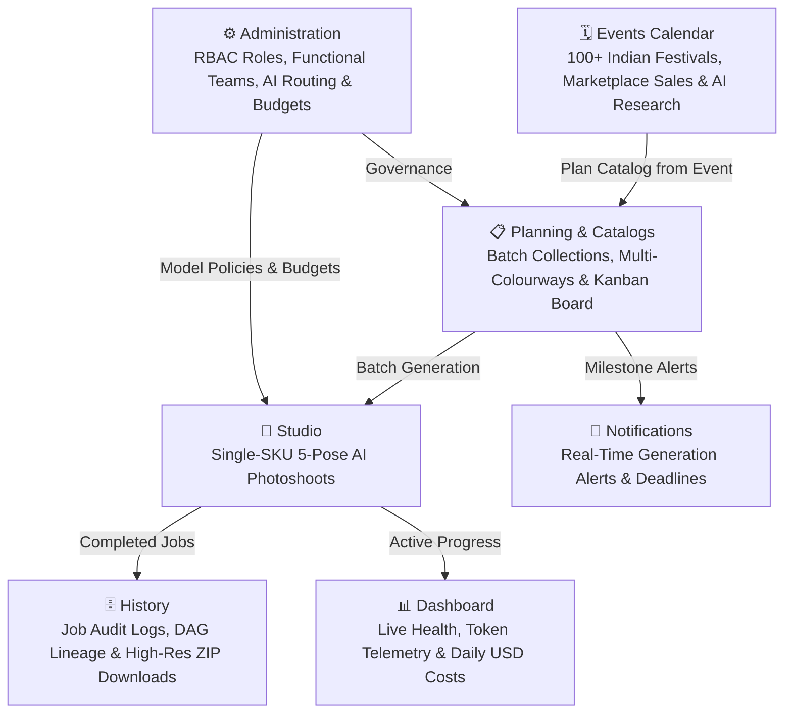

# Product Tour

Youthnic AI Studio is architected into two interconnected engines: **Studio** (for rapid, single-SKU AI photoshoots) and **Catalog Production & Planning** (for enterprise batch collections, marketing calendar alignment, and team production handoffs).

---

## The Core Photoshoot Flow

Every generation follows a strict, traceable lineage:

<Steps>
  <Step title="Reference Ingestion">
    Raw garment photos (front, back, fabric detail, bottom wear) are mapped to explicit roles alongside model identity and style references.
  </Step>
  <Step title="AI Garment Truth Extraction">
    Vision models dissect the garment's physical construction, extracting colors, silhouette, neckline, sleeve type, and absence locks into an immutable **Product Identity Profile**.
  </Step>
  <Step title="Creative & Styling Alignment">
    Studio backdrops and lighting parameters are derived from the Style Reference, while the stylist engine suggests matching footwear, jewellery, hair, and makeup.
  </Step>
  <Step title="Pose Compilation & Generation">
    The 5-pose commercial plan compiles into prompt contracts. Pose 1 establishes the visual anchor, and Poses 2–5 lock to that exact model, lighting, and setting.
  </Step>
  <Step title="Automated QA & Delivery">
    Every output is scored for facial realism and garment fidelity before being packaged into high-res downloads and listing handoffs.
  </Step>
</Steps>

---

## The Wider Platform Ecosystem

Youthnic AI Studio integrates 7 core modules to power complete apparel merchandising operations:

---

## Exploring the Platform Modules

<Tabs>
  <Tab title="1. Studio">
    **Your Virtual Photography Studio.**
    
    <Frame caption="Youthnic AI Studio — Interactive Photoshoot Canvas with 7 Reference Dropzones and Scene Styling">
      
    </Frame>

    - Upload reference images and run instant AI garment analysis.
    - Inspect neckline, fabric, and bottom-wear fidelity before spending generation credits.
    - Customize styling suggestions and pose camera framing.
    - Generate complete 5-pose editorial contact sheets in minutes.
    - [Read the Studio Guide &rarr;](/studio/overview)
  </Tab>

  <Tab title="2. Catalog Production">
    **Multi-SKU & Multi-Colourway Batch Engine.**
    
    <Frame caption="Youthnic AI Studio — Enterprise Catalog Production with Auto-Start, Stage Tracking, and QC Verification">
      
    </Frame>

    - Group colorways under unified collection batches.
    - Preflight entire batches for image completeness and styling approval.
    - Track progress across an interactive 5-stage Kanban board.
    - Assign dedicated leads for AI generation and marketplace listing.
    - [Read the Catalog Production Guide &rarr;](/catalog-production/overview)
  </Tab>

  <Tab title="3. Events & Calendar">
    **Festive & Marketplace Campaign Roadmap.**
    
    <Frame caption="Youthnic AI Studio — Campaign Intelligence & Events Roadmap with Gemini AI Research Integration">
      
    </Frame>

    - Track over 100+ Indian regional festivals (Diwali, Navratri, Durga Puja, Eid) and marketplace sales (Amazon GIF, Myntra BFF, Flipkart BBD).
    - AI Event Research provides campaign briefs, trending colors, and styling props.
    - Jump directly from an event into a pre-configured planning batch.
    - Export schedules to Excel or email to merchandising teams.
    - [Read the Events Guide &rarr;](/events/overview)
  </Tab>

  <Tab title="4. Planning">
    **Merchandising Operations & Schedules.**
    - Plan seasonal fashion campaigns and generation capacity.
    - Manage deadlines, SLAs, and colorway volume requirements.
    - Monitor generation queues and schedule bulk batch runs.
    - [Read the Planning Guide &rarr;](/planning/overview)
  </Tab>

  <Tab title="5. Dashboard">
    **Executive & Operational Command Center.**
    
    <Frame caption="Youthnic AI Studio — Real-Time Operations Summary, 14-Day Output Volume, and Authoritative Dollar Spend">
      
    </Frame>

    - Live monitoring of active generation jobs with real-time pose progress bars.
    - 14-day interactive analytics for generation volume, token telemetry, and actual USD costs.
    - High-level catalog metrics: active batches, completed colorways, and blocked items.
    - [Read the Dashboard Guide &rarr;](/dashboard/overview)
  </Tab>

  <Tab title="6. History">
    **Comprehensive Generation Audit Trail.**
    
    <Frame caption="Youthnic AI Studio — Permanent Generation Archive with Complete 5-Pose Saree Photoshoot Set and Per-Pose Costs">
      
    </Frame>

    - Search and filter all past photoshoots by SKU, date, or status.
    - Inspect interactive generation DAG flow graphs showing asset lineage from prompt to pixel.
    - Download high-resolution single images or complete collection ZIPs.
    - Trigger isolated retries on failed or rejected poses.
    - [Read the History Guide &rarr;](/history/overview)
  </Tab>

  <Tab title="7. Administration">
    **Enterprise Governance & Cost Controls.**
    - User access management and team assignment (Planning, Generation, Review, Listing).
    - Granular Role-Based Access Control (RBAC).
    - Multi-provider AI model routing (Google Gemini, OpenAI, Qwen, Meta Muse Spark) with automatic failover.
    - Daily organization USD budget limits and automated reporting.
    - [Read the Admin Guide &rarr;](/admin/overview)
  </Tab>
</Tabs>

---

## Next Steps

<CardGroup cols={2}>
  <Card title="Get Started" icon="rocket" href="/getting-started/overview">
    Set up your account, log in, and prepare for your first photoshoot.
  </Card>
  <Card title="Learn Studio Details" icon="camera" href="/studio/overview">
    Deep-dive into reference roles, garment truth contracts, and pose planning.
  </Card>
</CardGroup>
