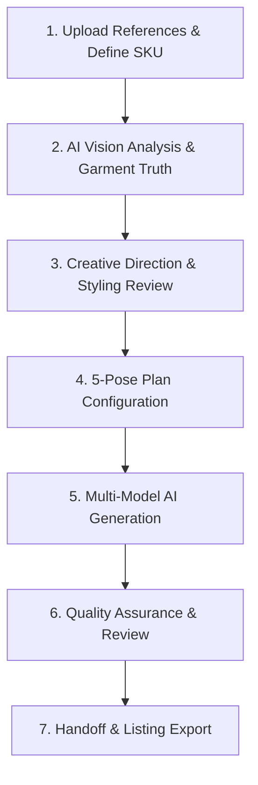

# Product Workflow

Youthnic AI Studio converts raw garment images into complete e-commerce catalogs through a systematic 7-stage pipeline.

---

## The 7 Stages of Catalog Production

### Stage 1: Upload References & Define SKU
Users upload raw product photos into designated reference roles:
- **Product Truth**: Front, Back, Fabric Detail, and Bottom Wear (if two-piece).
- **Creative Continuity**: Model Identity (face reference) and Style Reference (studio backdrop and lighting).
- **Metadata**: SKU Code, Product Name, Garment Family (e.g. Kurta Set, Saree, Lehenga), and any special styling or fit instructions.

[SCREENSHOT REQUIRED:
Studio → Product References upload panel
Show uploaded thumbnails with green role badges (Front, Back, Fabric, Bottom, Style Reference).
Target Filename: `images/studio/product-references-uploaded.webp`]

---

### Stage 2: AI Vision Analysis & Garment Truth
The platform dispatches the reference images to the vision analysis pipeline (powered by Google Gemini Flash or OpenAI Luna with automatic failover):
- Identifies primary and secondary colors, fabric weave, neckline geometry, sleeve length, and bottom wear architecture.
- Extracts regional evidence (front yoke, hem, side seams, rear closures).
- Establishes absence hard locks to ensure non-existent trims are never hallucinated.

---

### Stage 3: Creative Direction & Styling Review
The analysis compiles a unified creative brief:
- **Studio Set**: Derives wall plaster finish, floor surface, lighting angle, and color grade directly from your uploaded **Style Reference**.
- **Negative Background Rule**: Pre-shoot backgrounds in product photos (terracotta walls, arches, urns, plants) are automatically discarded.
- **Stylist Suggestions**: Proposes cohesive footwear, minimal jewelry, hair styling, and makeup tailored to the garment theme.

---

### Stage 4: 5-Pose Plan Configuration
The platform populates the standard 5-pose commercial plan:
1. **Full Front Hero**: Clean commercial anchor.
2. **Three-Quarter Side**: Reveals drape depth and side construction.
3. **Rear Full View**: Shoulders away, dupatta draped forward.
4. **Creative Editorial Pose**: Elegant seated pose if demanded by the style reference or product notes; otherwise, dynamic walking or swirl movement.
5. **Intimate Detail Close-Up**: Tight chest-to-waist crop highlighting embroidery or weave.

Users can enable/disable poses, customize camera framing, or modify specific prompt instructions.

---

### Stage 5: Multi-Model AI Generation
When the user clicks **Generate Photoshoot**, the backend compiles the full prompt contract and routes generation to the approved OpenAI GPT Image engine:
- **Pose 1 Generates First**: Creates the foundational anchor for model face, hair, and studio backdrop.
- **Poses 2–5 Lock to Pose 1**: Subsequent poses reuse Pose 1 as a visual continuity anchor, ensuring 100% lighting, backdrop, and identity coherence.

[VIDEO REQUIRED:
Title: Studio Photoshoot Generation Lifecycle
Duration: 20 seconds
Record: Clicking Generate -> live progress bar advancing through poses -> completed contact sheet appearing.
Suggested Filename: `videos/studio/generation-lifecycle.mp4`]

---

### Stage 6: Quality Assurance & Review
Every generated image passes through an automated QA validator:
- Assesses facial photorealism, eye alignment, and skin texture.
- Validates that front and back garment details match the authoritative reference images.
- Tags images as `automatically_verified` or `unverified` for manual human review.
- If a pose needs adjustments, users can trigger **Regenerate** with specific corrective feedback without re-running the entire shoot.

---

### Stage 7: Handoff & Listing Export
Once approved:
- Download individual full-resolution 2K/4K images formatted in standard 3:4 e-commerce aspect ratios.
- Download a packaged `.zip` archive containing all 5 poses named by SKU and pose index.
- In **Catalog Production**, the SKU transitions automatically to `QC Passed` &rarr; `Ready for Listing` on the Kanban board.

---

## Next Steps

<CardGroup cols={2}>
  <Card title="Take the Product Tour" icon="compass" href="/introduction/product-tour">
    See visual diagrams of how Studio, Planning, and Catalogs connect.
  </Card>
  <Card title="Start Your First Photoshoot" icon="sparkles" href="/getting-started/create-first-photoshoot">
    Step-by-step tutorial for producing your first single-SKU photoshoot.
  </Card>
</CardGroup>
