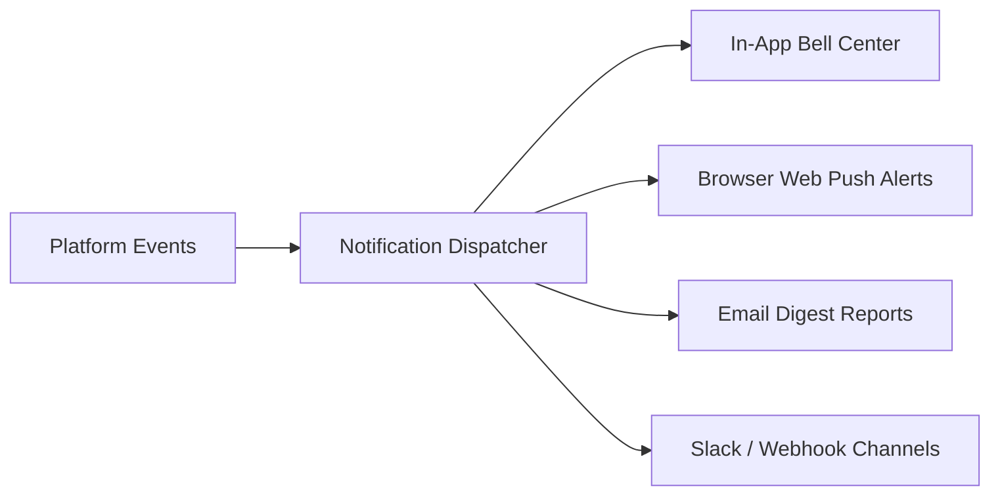

# Notifications Overview

Staying updated on long-running catalog batches, creative approvals, and upcoming festival deadlines is managed through the centralized **Notifications Center** (`/notifications`).

---

## Accessing Notifications

Click the **Bell Icon** in the top navigation bar from any screen:

[SCREENSHOT REQUIRED:
Page: Any page header (/studio or /dashboard)
Exact State: Notifications dropdown menu open showing unread alert badge '3' and a list of recent notification cards with action buttons.
Exact UI Section: Top right header notifications dropdown.
Recommended Crop: 420x480
Recommended Dimensions: 420x480
Filename: notifications-header-dropdown.webp]

To view the full-page notification management console, click **View All Notifications** or navigate to `/notifications`.

---

## Notification Center Features

[SCREENSHOT REQUIRED:
Page: Notifications Center (/notifications)
Exact State: Full notifications management page displaying category tabs (All, Generation, Planning, Events, System) with mark-as-read buttons.
Exact UI Section: Notifications Center full view.
Recommended Crop: 1200x650
Recommended Dimensions: 1200x650
Filename: notifications-center-full-view.webp]

- **Category Tabs**: Filter between *All*, *Generation Jobs*, *Planning & Approval*, *Event Deadlines*, and *System & Billing*.
- **Direct Navigation**: Clicking any notification item takes you directly to the relevant artifact (e.g. clicking *"Batch DP26 Completed"* opens the Catalog Hub).
- **Batch Actions**: Click **Mark All as Read** or **Clear Read Notifications** to keep your inbox clean.

---

## Configuring Notification Preferences

In your user profile settings, customize which delivery channels you prefer:
- **In-App Toast**: Pop-up banner in the bottom right corner of your screen.
- **Browser Push**: OS-level push notifications when the browser tab is in the background.
- **Email Alerts**: Sent immediately or bundled into a daily summary digest.

---

## Next Steps

- Deep dive into alert categories in [Notification Types](/notifications/notification-types).
- Configure organization admin settings in [Administration Overview](/admin/overview).
