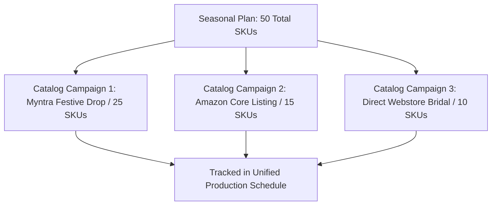

# Catalog Planning

A single seasonal collection may require multiple distinct catalog productions: one high-fashion editorial catalog for your flagship e-commerce storefront, a high-volume 4:5 catalog for Myntra, and a clean white-background catalog for Amazon.

**Catalog Planning** organizes your planned styles into targeted production campaigns.

---

## Creating Campaigns Inside a Plan

From the **Catalogs** tab of your plan, click **+ Add Catalog Campaign**:

[SCREENSHOT REQUIRED:
Page: Planning (/planning)
Exact State: Catalogs tab showing 3 active campaigns in different states with SKU counts, credit estimates, and target marketplaces.
Exact UI Section: Catalogs campaign list inside plan.
Recommended Crop: 1100x520
Recommended Dimensions: 1100x520
Filename: planning-catalogs-campaign-list.webp]

<Steps>
  <Step title="Select Products from Assortment">
    Check the specific SKUs from your product planning table that belong to this catalog drop.
  </Step>
  <Step title="Assign Target Marketplace Preset">
    Choose the framing preset (e.g. *Nykaa Fashion 3:4* or *Amazon 4:5*).
  </Step>
  <Step title="Lock Model Persona & Backdrop Set">
    Define the shared aesthetic (e.g. *Model: Tara, Backdrop: Jaipur Courtyard*).
  </Step>
  <Step title="Deploy to Catalog Hub">
    Click **Initialize Catalog**. A linked campaign is automatically created in the [Catalog Production](/catalog-production/overview) workspace, ready for photo uploads.
  </Step>
</Steps>

---

## Cross-Campaign Progress Sync

As operators upload photos and render poses inside the Catalog Production workspace, the Plan's progress bar and status gauges update in real time:

[SCREENSHOT REQUIRED:
Page: Planning (/planning)
Exact State: Progress widget showing 'Catalog 1: 100% Complete', 'Catalog 2: 60% Generating', 'Catalog 3: Staged'.
Exact UI Section: Cross-campaign progress breakdown widget.
Recommended Crop: 650x240
Recommended Dimensions: 650x240
Filename: planning-cross-campaign-progress.webp]

You always have an executive overview of which channels are ready to go live and which are awaiting rendering.

---

## Next Steps

- Harmonize dates with [Event-Driven Planning](/planning/event-driven-planning).
- Plan GPU queues in [Generation Schedule](/planning/generation-schedule).
