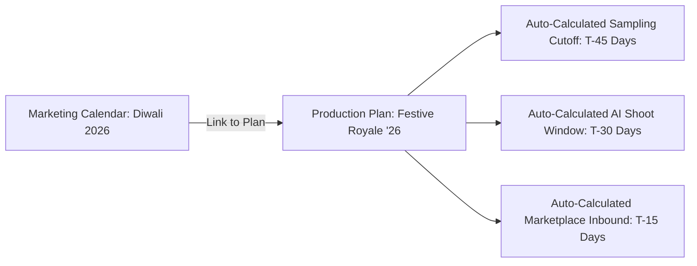

# Event-Driven Planning

Rather than planning collections in isolation, **Event-Driven Planning** binds your production milestones directly to the [Events & Marketing Calendar](/events/overview). 

If a marketplace changes its mega-sale kick-off date by one week, all linked production schedules, sample cutoffs, and generation deadlines recalculate automatically.

---

## Linking an Event to a Plan

Inside any plan workspace, click the **Link Calendar Event** button in the header:

[SCREENSHOT REQUIRED:
Page: Planning (/planning)
Exact State: 'Link Marketing Event' selector modal open with upcoming festivals listed (Diwali, Karwa Chauth, Myntra EORS) and their lead-time tags.
Exact UI Section: Link Calendar Event modal.
Recommended Crop: 600x480
Recommended Dimensions: 600x480
Filename: planning-link-event-modal.webp]

<Steps>
  <Step title="Select Primary Anchor Event">
    Choose the primary marketing date (e.g. *Diwali 2026*).
  </Step>
  <Step title="Select Secondary Events (Optional)">
    Add related regional festivals occurring in the same cluster (e.g. *Karwa Chauth* and *Bhai Dooj*) to share production assets.
  </Step>
  <Step title="Confirm Automatic Buffer Recalculation">
    Youthnic recalculates your plan's critical path based on the most demanding marketplace lead-time among the linked events.
  </Step>
</Steps>

---

## Automated Dynamic Date Adjustment

If external event dates change:
- Youthnic updates the anchor date in the global database.
- An alert banner appears in your plan: *"Myntra EORS dates moved forward by 4 days. Production window shortened. Recommended action: Accelerate sample photography."*
- One click updates all sub-campaign deadlines.

---

## Next Steps

- Map daily milestones in [Production Schedule](/planning/production-schedule).
- Configure overnight rendering in [Generation Schedule](/planning/generation-schedule).
