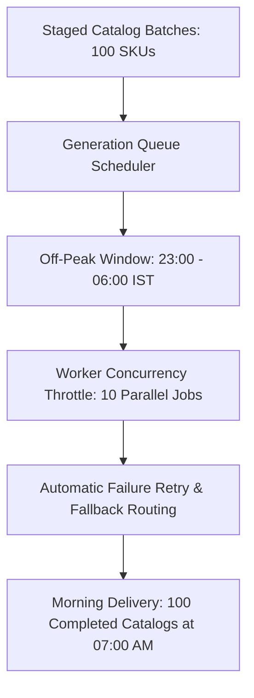

# Generation Schedule

Running high-volume fashion generation (e.g. 500 images across 100 colourways) during peak business hours can consume team bandwidth and encounter cloud provider rate limits. 

The **Generation Schedule** allows brands to queue batches for automated execution during off-peak windows (such as overnight between 11:00 PM and 6:00 AM).

---

## The Generation Queue Calendar

Open the **Generation Schedule** sub-tab in Planning:

[SCREENSHOT REQUIRED:
Page: Planning (/planning?tab=generation-schedule)
Exact State: Weekly GPU time-block calendar showing scheduled overnight batch slots with expected credit consumption and active worker gauges.
Exact UI Section: Generation schedule time-block view.
Recommended Crop: 1200x650
Recommended Dimensions: 1200x650
Filename: planning-generation-schedule-calendar.webp]

---

## Scheduling a Batch Run

<Steps>
  <Step title="Select Catalog Campaigns">
    Choose which staged campaigns are queued for this execution window.
  </Step>
  <Step title="Choose Time Window">
    Select an execution slot:
    - **Overnight Off-Peak (Recommended)**: 11:00 PM – 06:00 AM IST.
    - **Immediate Background Queue**: Runs at moderate concurrency during standard hours.
    - **Custom Timestamp**: Specific scheduled date/hour.
  </Step>
  <Step title="Set Worker Concurrency Limits">
    Define the maximum parallel GPU workers allocated to this job (Default: `8 parallel jobs`) to prevent exceeding provider rate limits.
  </Step>
  <Step title="Enable Automatic Queue Pause">
    Configure safety triggers: e.g. *"Pause queue if 3 consecutive colourways fail QA validation."*
  </Step>
</Steps>

---

## Morning Batch Completion Summary

When scheduled jobs complete overnight, an automated **Morning Delivery Digest** is generated:

[SCREENSHOT REQUIRED:
Page: Planning (/planning?tab=generation-schedule)
Exact State: Morning Delivery Digest modal showing 'Overnight Batch Completed: 48 of 50 SKUs Passed (96% Pass Rate) - 240 Credits Consumed'.
Exact UI Section: Morning Batch Digest modal.
Recommended Crop: 600x480
Recommended Dimensions: 600x480
Filename: planning-morning-batch-digest.webp]

The report highlights:
- Total images successfully rendered.
- Quality pass rate percentage.
- Direct links to inspect the 2 flagged items that need manual review.

---

## Next Steps

- Understand plan life-cycles in [Plan Status & Workflow](/planning/plan-status-workflow).
- Monitor live spend and system health in [Dashboard](/dashboard/overview).
