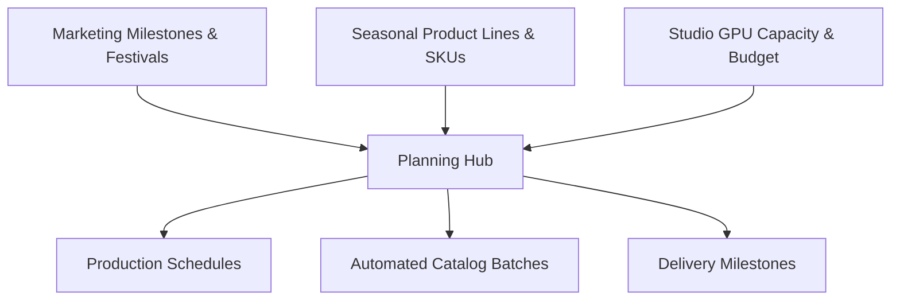

# Planning Overview

The **Planning** module (`/planning`) is the central operational bridge connecting your brand's seasonal collection roadmap, marketing calendar deadlines, physical sampling schedules, and AI Studio production capacity.

---

## Core Planning Modules

<CardGroup cols={2}>
  <Card title="Product Planning" icon="shirt">
    Organize styles, silhouettes, fabric lines, and target SKU quotas across collections (e.g. Autumn/Winter '26).
  </Card>
  <Card title="Catalog Planning" icon="book-open">
    Group multi-SKU colourways into structured catalog campaigns targeted for Amazon, Myntra, Nykaa, or direct storefronts.
  </Card>
  <Card title="Event-Driven Planning" icon="calendar-check">
    Directly tie collection drops to upcoming cultural festivals and marketplace mega-sales with automated lead-time buffers.
  </Card>
  <Card title="Production & Generation Schedules" icon="clock">
    Schedule sample arrival deadlines, creative review windows, and overnight GPU batch generation queues.
  </Card>
</CardGroup>

---

## The Planning Workspace Layout

Navigate to **Planning** (`/planning`) from the primary sidebar:

[SCREENSHOT REQUIRED:
Page: Planning (/planning)
Exact State: Planning hub overview displaying seasonal collection cards, active production timelines, and overall budget burn gauge.
Exact UI Section: Full Planning dashboard view.
Recommended Crop: 1920x950
Recommended Dimensions: 1400x690
Filename: planning-workspace-overview.webp]

The interface features:
- **Top Summary Metric Strip**: Total Active Plans, Staged SKUs, Scheduled Generation Jobs, and Credit Allocation.
- **Tab Navigation**: Switch between *Plans*, *Catalogs*, *Production Timeline*, and *Capacity Schedule*.
- **Plan Cards**: Visual cards displaying progress bars, assigned teams, deadline countdowns, and operational statuses (`Draft`, `In Review`, `In Production`, `Completed`).

---

## Next Steps

- Create your first seasonal plan in [Create a Plan](/planning/create-plan).
- Map styles in [Product Planning](/planning/product-planning).
- Link campaigns to festivals in [Event-Driven Planning](/planning/event-driven-planning).
