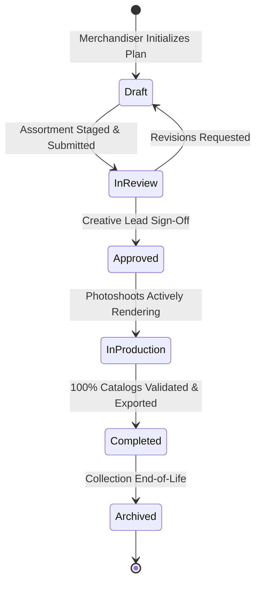

# Plan Status & Workflow

Every production plan in Youthnic AI Studio advances through a rigorous operational lifecycle. This prevents unapproved campaigns from accidentally triggering expensive GPU generation and ensures complete traceability.

---

## Plan Operational States

[SCREENSHOT REQUIRED:
Page: Planning (/planning)
Exact State: Plan status transition dropdown open showing active state 'In Production' with status badges and transition buttons.
Exact UI Section: Plan header status bar.
Recommended Crop: 650x220
Recommended Dimensions: 650x220
Filename: planning-status-lifecycle-dropdown.webp]

<Tabs>
  <Tab title="1. Draft (`draft`)">
    - **Description**: Initial staging state. Merchandisers can freely add, edit, or remove SKUs, change target quotas, and adjust dates.
    - **Permissions**: Creator, Merchandisers, Admins.
    - **Generation**: **Locked**. No credits can be spent while in Draft.
  </Tab>

  <Tab title="2. In Review (`review`)">
    - **Description**: Staging is complete. Submitted to the creative director and merchandising lead for budget and aesthetic sign-off.
    - **Permissions**: Styling Lead, Creative Director, Admin.
    - **Generation**: Locked.
  </Tab>

  <Tab title="3. In Production (`in_production`)">
    - **Description**: Plan is approved. Operators can trigger Studio shoots, schedule batch jobs, and review live generation outputs.
    - **Permissions**: Studio Operators, Merchandisers, Admins.
    - **Generation**: **Active**. Credits deducted upon render execution.
  </Tab>

  <Tab title="4. Completed (`completed`)">
    - **Description**: All catalog campaigns have reached 100% completion, assets are exported to marketplace listings, and QA scores are locked.
    - **Permissions**: Read-only for general members; Admins can re-open if revisions are required.
  </Tab>

  <Tab title="5. Archived (`archived`)">
    - **Description**: Seasonal collection has concluded. Stored for historical reference and model performance analytics.
  </Tab>
</Tabs>

---

## Transitioning States & Audit Logging

When an authorized user advances a plan's state:
- The transition is timestamped and recorded in the organization's audit log.
- Automated email and in-app notifications are dispatched to all assigned team members.
- If a plan in `In Production` has overdue milestones, its status badge displays an amber warning pill.

---

## Next Steps

- Monitor real-time organization metrics in [Dashboard](/dashboard/overview).
- Search previous generations in [Generation History](/history/overview).
