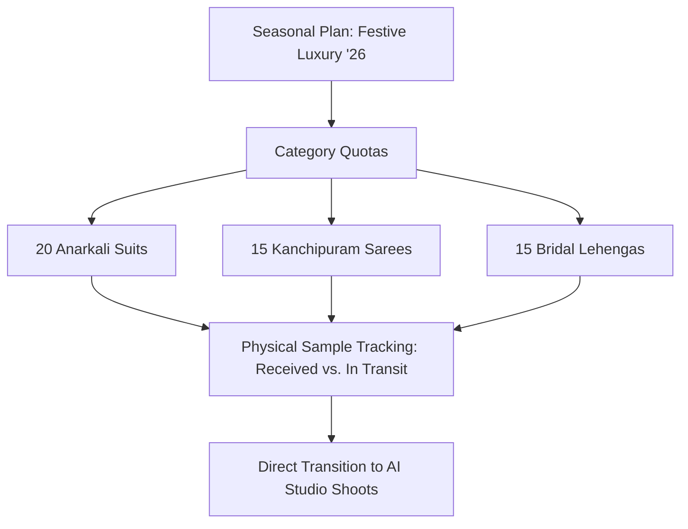

# Product Planning

Before shooting begins, fashion merchandisers map out collection assortments. **Product Planning** allows you to outline target garment categories, define silhouette quotas, and track physical fabric sample arrivals before uploading photos to the Studio.

---

## Defining Silhouette Assortments & Quotas

Inside the **Products** tab of your plan, configure the target garment distribution:

[SCREENSHOT REQUIRED:
Page: Planning (/planning)
Exact State: Products tab active showing category breakdown donut chart (Anarkalis 40%, Sarees 30%, Lehengas 30%) and SKU quota progress bars.
Exact UI Section: Product assortment quota summary.
Recommended Crop: 1100x420
Recommended Dimensions: 1100x420
Filename: planning-product-assortment-quotas.webp]

- **Target SKU Allocation**: Set how many styles belong to each silhouette.
- **Pose Standard Inheritance**: Assign default pose standards (e.g. 5-pose catalog for Anarkalis; 7-pose saree standard with pallu close-up for Kanchipuram silks).
- **Fabric & Color Restrictions**: Define permitted fabric blends (Pure Silk, Velvet, Georgette) to prevent misclassified uploads later.

---

## Physical Sample Tracking

Avoid bottlenecks where studio operators wait indefinitely for delayed factory samples:

[SCREENSHOT REQUIRED:
Page: Planning (/planning)
Exact State: Sample tracking table showing columns for Sample ID, Style Code, Factory Partner, Delivery ETA, and Sample Status badge ('Received at Studio').
Exact UI Section: Sample tracking data table.
Recommended Crop: 1200x480
Recommended Dimensions: 1200x480
Filename: planning-sample-tracking-table.webp]

Each product row tracks:
- **Sample Tracking Code**: Internal factory tag (e.g. `SMPL-BLR-892`).
- **Physical Sample Status**:
  - `Pattern Making`
  - `In Transit from Factory`
  - `Received at Studio` (Ready for photography)
  - `Sample Approved`
- **Instant Shoot Action**: When marked as *"Received at Studio"*, an **Open in Studio** button activates, pre-filling the SKU and category into a new photoshoot session immediately.

---

## Next Steps

- Group multi-colourway styles in [Catalog Planning](/planning/catalog-planning).
- Schedule batches in [Production Schedule](/planning/production-schedule).
