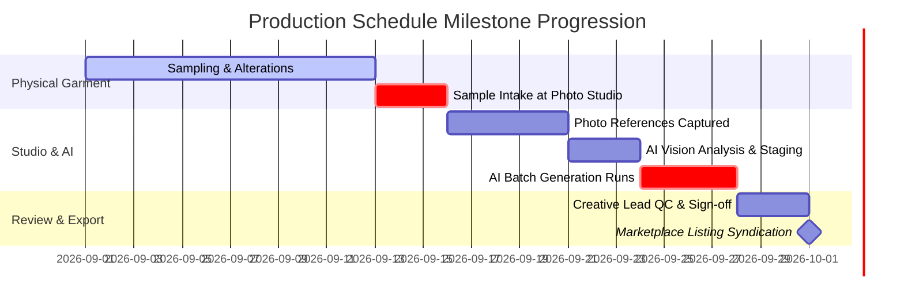

# Production Schedule

The **Production Schedule** view tracks the cross-functional workflow required to bring physical fashion samples from the design studio to finalized e-commerce listings.

---

## The Schedule Master View

Click the **Production Schedule** tab in the Planning hub:

[SCREENSHOT REQUIRED:
Page: Planning (/planning?tab=schedule)
Exact State: Production Schedule Gantt chart view displaying active collection tracks with milestone markers, team avatars, and stage bars.
Exact UI Section: Production schedule master view.
Recommended Crop: 1400x700
Recommended Dimensions: 1400x700
Filename: planning-production-schedule-gantt.webp]

---

## Production Stage Definitions

| Stage | Owner | Core Activity |
| :--- | :--- | :--- |
| **1. Sampling** | Merchandising & Sourcing | Tracking physical garment pattern cutting, stitching, and factory dispatch. |
| **2. Intake & Capture** | In-House Photography | Steaming garments, capturing clean front/back mannequin photos, and capturing fabric weave swatches. |
| **3. AI Staging & Preflight** | Studio Operator | Uploading references into Youthnic Studio, assigning semantic roles, and running vision preflight checks. |
| **4. AI Generation** | GPU Automated Cluster | Concurrent or sequential rendering of the 5-pose catalog sequence. |
| **5. Quality Assurance (QC)** | Creative Lead / Stylist | Reviewing automated QA scorecards, approving color fidelity, and requesting pose regenerations. |
| **6. Listing Ready** | E-Commerce Manager | Exporting SKU ZIP packages and syndicating image URLs to marketplace catalogs. |

---

## Capacity & Workload Balancing

The schedule includes an automated **Team Workload Barometer**:
- Alerts you if an individual studio operator has more than 15 colourways queued for manual inspection on a single day.
- Allows one-click re-assignment of SKUs between operators.

---

## Next Steps

- Automate cloud rendering runs in [Generation Schedule](/planning/generation-schedule).
- Understand operational states in [Plan Status & Workflow](/planning/plan-status-workflow).
