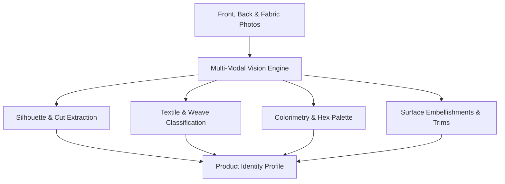

# AI Product Analysis

Before generating a photoshoot, Youthnic AI Studio runs **AI Product Analysis** (`analyzeGarment`). This process extracts geometric, structural, textile, and color features from your uploaded references, building a technical fashion specification that guides the generative models.

---

## Triggering Garment Analysis

After uploading at least one front reference photo, click the **Analyze Garment** button at the top right of the Product Photos card.

[SCREENSHOT REQUIRED:
Page: Studio (/studio)
Exact State: Mouse hovering over the 'Analyze Garment' button, which shows a sparkling icon and tooltip 'Extract fashion taxonomy and color palette'.
Exact UI Section: Top right corner of Product Photos card.
Recommended Crop: 300x150
Recommended Dimensions: 300x150
Filename: studio-analyze-garment-button.webp]

The analysis typically takes between 4 and 8 seconds. During this phase:
1. High-resolution crops are created of the neckline, sleeve hems, fabric weave, and waistline.
2. The vision engine processes the images against our specialized fashion taxonomy ontology.
3. Extracted attributes are populated into the **Product Identity Profile**.

---

## What the Vision Engine Analyzes

<AccordionGroup>
  <Accordion title="1. Silhouette & Architecture" icon="shapes">
    Detects garment outline, hemline sweep, waistline cinch, slit locations (side slits, front slit), and fit classification (relaxed, tailored, structured, bodycon, flared).
  </Accordion>

  <Accordion title="2. Textile Weave & Fabric Physics" icon="rug">
    Identifies fabric composition (mulmul cotton, raw silk, satin, georgette, chiffon, velvet, linen) and assigns drape stiffness, specular reflectivity, and light translucency values.
  </Accordion>

  <Accordion title="3. Optical Color Extraction (Hex Palette)" icon="palette">
    Extracts the dominant body color, secondary accent colors, and metallic trim colors in exact sRGB hex codes (e.g. `#8B0000` Deep Crimson, `#D4AF37` Metallic Gold Zari).
  </Accordion>

  <Accordion title="4. Neckline, Sleeves & Collar Construction" icon="shirt">
    Identifies precise collar architecture: Sweetheart neck, Scoop, Boat neck, V-neck, Mandarin collar, Halter neck, Raglan sleeves, Bishop sleeves, Cap sleeves, or Sleeveless.
  </Accordion>

  <Accordion title="5. Surface Embellishments & Trims" icon="gem">
    Detects hand-embroidery techniques: Gotapatti, Zardozi, Chikankari, Mirror work, Sequin embroidery, Resham thread work, Foil print, or Block print.
  </Accordion>
</AccordionGroup>

---

## Analysis Confidence Badges

Each detected property displays a confidence indicator badge:
- Green (90–100%): High optical certainty. Directly verified across multiple reference angles.
- Amber (70–89%): Moderate certainty. Suggested based on context (e.g. fabric weave partially obscured by studio shadow).
- Red (Under 70%): Ambiguous attribute. Manual user confirmation recommended.

[SCREENSHOT REQUIRED:
Page: Studio (/studio)
Exact State: Product Identity Profile card showing green, amber, and red confidence badges next to detected attributes.
Exact UI Section: Attribute listing table with confidence badges.
Recommended Crop: 600x380
Recommended Dimensions: 600x380
Filename: studio-analysis-confidence-badges.webp]

---

## Editing & Overriding Extracted Attributes

You have full control over the AI's conclusions. If the vision model detects *"Raw Silk"* but your garment is actually *"Art Silk Blended with Modal"*, click the attribute tag to edit it. The prompt synthesis engine will immediately adjust its latent conditioning weights.

[VIDEO REQUIRED:
Video ID: VID-STUDIO-003
Title: Overriding AI Garment Analysis Attributes
Duration: 14 seconds
Start State: Extracted Product Identity Profile visible.
Actions: Click on 'Primary Color' hex swatch, open color picker, change hex from `#A020F0` to `#800080`. Click on 'Neckline' tag, change from 'Round Neck' to 'Sweetheart Neck'.
End State: Profile shows updated tags with 'User-Modified' badge.
Suggested Filename: studio-override-attributes.mp4
Narration Required: No]

---

## Next Steps

- Explore the complete [Product Identity Profile](/studio/product-identity-profile) documentation.
- Configure [Creative Direction](/studio/creative-direction) to set up your photoshoot environment.
