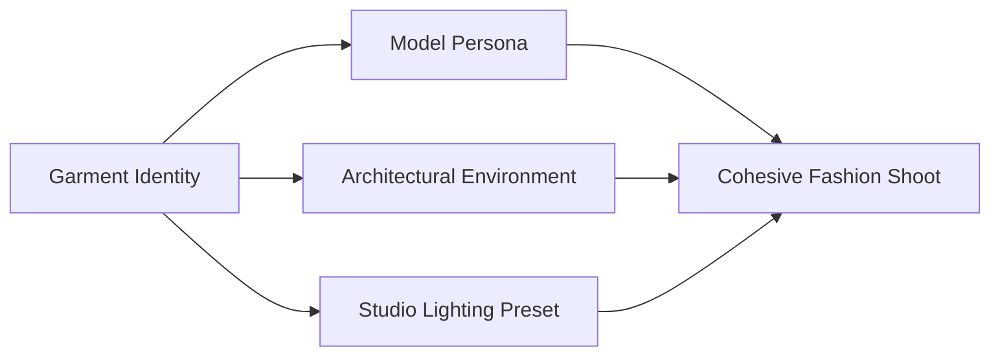

# Creative Direction

The **Creative Direction** module transforms your validated garment identity into an editorial or commercial fashion photoshoot. Here, you define the model persona, environment, lighting temperature, and camera styling.

---

## 1. Model Persona Selection

Click the **Model** tab to configure your photoshoot's protagonist. You can choose from pre-curated platform models or create custom brand-exclusive personas:

[SCREENSHOT REQUIRED:
Page: Studio (/studio)
Exact State: Model picker carousel open displaying diverse Indian and international fashion model cards with tags.
Exact UI Section: Model Selection gallery.
Recommended Crop: 900x480
Recommended Dimensions: 900x480
Filename: studio-model-picker-carousel.webp]

### Model Parameters

<Tabs>
  <Tab title="Demographics & Ethnicity">
    - **South Asian / Indian**: Diverse regional representations (North Indian, South Indian, East/Northeast Indian).
    - **Middle Eastern / Mediterranean**: Warm olive tones, expressive eyes, tailored for modest fashion and kaftan collections.
    - **Western / Caucasian**: Contemporary global e-commerce styling.
    - **East Asian / Pan-Asian**: Modern minimalist aesthetics.
  </Tab>
  <Tab title="Age Bracket & Expression">
    - **Young Contemporary (18–24)**: Fresh, youthful, subtle smile, casual energy.
    - **Luxury & Bridal (25–34)**: Poised, regal, calm gaze, refined posture.
    - **Classic Elegant (35–48)**: Mature, sophisticated, confident executive demeanor.
  </Tab>
  <Tab title="Hair & Makeup Look">
    - **Dewy Festive**: Radiant skin, neutral glossy lip, soft kohl-rimmed eyes, loose romantic waves.
    - **Editorial Matte**: Sculpted cheekbones, bold defined lip, clean center-parted sleek bun.
    - **Natural Commercial**: Minimalist no-makeup look, clean ponytail, fresh e-commerce catalog aesthetic.
  </Tab>
</Tabs>

---

## 2. Architectural Set & Environment

Select an environment that complements the garment without competing for visual attention:

[SCREENSHOT REQUIRED:
Page: Studio (/studio)
Exact State: Backdrop environment dropdown open showing preset cards with photo previews (Minimal Studio, Sunlit Courtyard, Modern Loft).
Exact UI Section: Set & Backdrop selector.
Recommended Crop: 600x450
Recommended Dimensions: 600x450
Filename: studio-environment-presets.webp]

| Environment Preset | Aesthetic Profile | Recommended Garments |
| :--- | :--- | :--- |
| **Clean Cyclorama (White/Cream)** | Seamless infinity curve, subtle floor drop shadow, pure e-commerce focus. | Daily wear kurtis, western tops, basic trousers, marketplace listings. |
| **Jaipur Heritage Courtyard** | Sandstone jharokhas, carved pillars, lime-plaster arches, warm sunlight. | Heavy bridal lehengas, banarasi sarees, royal anarkali gowns. |
| **Modernist Sunlit Gallery** | Polished micro-cement floors, minimalist geometric niches, large diffused windows. | Contemporary fusion wear, indo-western co-ords, luxury pret. |
| **Botanical Greenhouse** | Monochromatic tropical foliage, warm conservatory glass, dappled sunbeam shadows. | Resort wear, organza floral sarees, linen kurtas. |

---

## 3. Lighting Presets

Youthnic provides four optical lighting configurations calibrated for commercial apparel:

<CardGroup cols={2}>
  <Card title="High-Key Commercial Studio" icon="sun">
    Even, shadowless 3-point softbox illumination. Ensures exact color reading on Amazon, Myntra, and Nykaa catalogs.
  </Card>
  <Card title="Golden Hour Sunbeam" icon="sunset">
    Warm directional sunlight streaming at a 30-degree angle, casting soft dramatic shadows and illuminating sheer fabrics.
  </Card>
  <Card title="Soft North-Facing Daylight" icon="cloud-sun">
    Gentle skylight illumination through large studio windows. Ideal for showing realistic fabric drape without harsh highlights.
  </Card>
  <Card title="Editorial High-Contrast" icon="bolt">
    Dramatic fashion magazine lighting with deliberate rim highlights that accentuate metallic zari and sequin embroidery.
  </Card>
</CardGroup>

---

## 4. Style Reference Transfer

If your brand has an existing photoshoot lookbook and you want all new AI generations to match that exact photography style:
1. Upload a sample lookbook photo into the **Style Reference** slot in the Product Photos panel.
2. Under Creative Direction, set the **Style Transfer Intensity** slider (Recommended: `75%`).
3. The AI extracts the camera angle, color grading LUT, and background depth while keeping your garment 100% untouched.

---

## Next Steps

- Refine accessories with [Styling Recommendations](/studio/styling-recommendations).
- Review and customize the [Five-Pose Catalog Plan](/studio/pose-planning).
