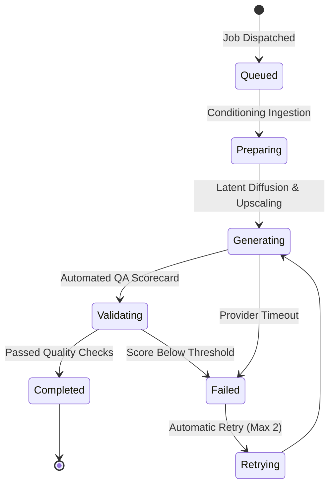

# Generation Progress

Once generation is launched, the Studio canvas switches into the **Active Generation Monitor**. Each pose tile transitions through distinct operational stages in real time.

---

## Generation Stages & Indicators

[SCREENSHOT REQUIRED:
Page: Studio (/studio)
Exact State: Five pose tiles showing mixed states (Tile 1: Completed with green badge, Tile 2: Validating 80%, Tile 3: Generating 45%, Tile 4: Preparing, Tile 5: Queued).
Exact UI Section: Studio results canvas with live status badges and progress bars.
Recommended Crop: 1200x650
Recommended Dimensions: 1200x650
Filename: studio-generation-mixed-states.webp]

<Tabs>
  <Tab title="1. Queued">
    The job is acknowledged by the message queue and assigned to an available GPU worker. Typically lasts 1–3 seconds.
  </Tab>
  <Tab title="2. Preparing (Conditioning)">
    The worker ingests the reference images, applies depth and edge feature extractors, and prepares prompt conditioning tensors.
  </Tab>
  <Tab title="3. Generating (Diffusion)">
    The generative diffusion model runs iterative denoising passes, progressively resolving fabric drape, facial features, and background architecture. A circular progress percentage (`0% → 100%`) updates live.
  </Tab>
  <Tab title="4. Validating (Automated QA)">
    The rendered high-resolution image is inspected by the secondary automated QA vision model for anatomical accuracy, garment fidelity, and color adherence.
  </Tab>
  <Tab title="5. Completed">
    The image is verified, uploaded to high-speed CDN storage, and rendered into your canvas in 4K resolution.
  </Tab>
</Tabs>

---

## Stopping or Cancelling a Job

If you notice a critical error in your configuration while rendering is in progress (e.g. you uploaded the wrong garment photo):

1. Click the red **Stop Generation** button in the header bar.
2. The orchestrator immediately signals active workers to abort.
3. Unstarted poses are cancelled, and unused credits are refunded to your balance immediately.

[SCREENSHOT REQUIRED:
Page: Studio (/studio)
Exact State: Stop generation modal confirmation dialog asking 'Cancel remaining poses and refund 3 credits?'.
Exact UI Section: Cancel generation modal dialog.
Recommended Crop: 450x260
Recommended Dimensions: 450x260
Filename: studio-cancel-generation-modal.webp]

---

## Background Rendering & Notifications

You do not need to keep the Studio tab focused while generation runs:
- You can navigate to other parts of the platform (like [Events](/events/overview) or [Catalog Production](/catalog-production/overview)).
- A browser push notification and in-app bell alert will notify you when all 5 poses have finished rendering.

---

## Next Steps

- Understand the automated quality scorecard in [Quality Validation](/studio/quality-validation).
- Learn how to [Regenerate or Retry an Image](/studio/regenerate-retry).
