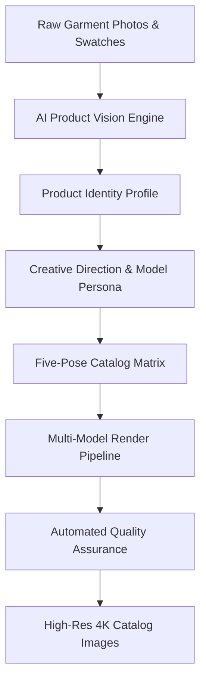

# Studio Overview

The **Studio** (`/studio`) is the core creative workspace of Youthnic AI Studio. It transforms raw garment photos, flat lays, mannequin shots, and fabric swatches into high-fashion commercial photoshoots with full editorial control over lighting, models, styling, and poses.

---

## Workspace Layout

The Studio interface is organized into four intuitive functional zones designed for rapid catalog production:

<Frame caption="Live Youthnic AI Studio Workspace — showing 7 Product Photo Upload Dropzones, Model Face Reference, SKU Metadata, Output Settings, and Scene & Styling Engine">
  
</Frame>

<CardGroup cols={2}>
  <Card title="1. Product Evidence Upload Grid" icon="images">
    Dedicated drag-and-drop evidence slots for **Front** (required), **Back** (required), **Fabric/Pattern Detail**, **Bottom Wear / Farshi**, **Mannequin / Flat-lay**, **Additional Photo**, and optional **Model Face Reference**.
  </Card>
  <Card title="2. SKU Details & Taxonomy" icon="tags">
    Input **SKU Code** (e.g. `YTH-KUR-2041`), **Product Name**, detailed garment specifications, and market categorization (**Ethnic / fusion**, Western, Festive, etc.).
  </Card>
  <Card title="3. Output Quality & Resolution Settings" icon="sliders">
    Fine-tune rendering parameters including generation engine (e.g. `gpt-image-2`), aspect ratio (`3:4` vertical portrait), resolution (`2K`), and quality tier.
  </Card>
  <Card title="4. Scene & Styling Intelligence" icon="wand-magic-sparkles">
    AI-powered **Analyze Now** and **Improve Pose Plan** controls that generate tailored scene directions, backdrops, lighting, and garment summaries.
  </Card>
</CardGroup>

---

## Core Capabilities

### 1. Zero Model or Studio Overhead
Eliminate traditional photoshoot logistical delays. Rather than hiring models, booking studios, steaming physical samples, and arranging photography crews, you can generate an entire 5-pose commercial shoot in under 90 seconds.

### 2. High-Precision Garment Fidelity
Youthnic's specialized dual-pass conditioning architecture preserves fine garment details:
- Exact color matching to physical fabric samples.
- Intricate micro-embroidery, zari borders, sequin reflections, and prints.
- Accurate garment drape and translucency (e.g. sheer organza vs. heavy velvet).

### 3. Native Indian Ethnic & Western Support
Unlike generic image generators that struggle with South Asian attire, Youthnic has purpose-built support for complex ethnic wear:
- Saree pleats, pallu drapes, and blouse cutaways.
- Multi-piece lehengas with dupatta tucking and flare drape.
- Salwar kameez, anarkalis, sharara sets, and kurtis.
- Western co-ord sets, dresses, shirts, and tailored outerwear.

### 4. Marketplace-Compliant Framing
One-click framing presets automatically align aspect ratios, margin paddings, and eye-level rules for major e-commerce platforms including **Amazon**, **Myntra**, **Nykaa Fashion**, **Ajio**, **Tata CLiQ**, and **Shopify**.

---

## Production Workflows in Studio

<Tabs>
  <Tab title="Single Product Shoot">
    Ideal for bespoke designs, hero campaign pieces, or rapid sample validation before production runs. Upload photos, tweak styling, and generate immediate 5-pose results.
  </Tab>
  <Tab title="Multi-Piece Ensembles">
    Use advanced **Reference Roles** to shoot complex multi-garment outfits (e.g. pairing a specific kurti with palazzo bottoms and a contrasting banarasi dupatta).
  </Tab>
  <Tab title="Style Reference Transfer">
    Upload an existing high-fashion editorial photo into the **Style Reference** slot to borrow lighting, mood, model pose, and composition while preserving your exact garment.
  </Tab>
</Tabs>

---

## Next Steps

- [Start a Photoshoot](/studio/start-a-photoshoot) to walk through the step-by-step setup.
- [Upload Product Images](/studio/upload-product-images) to master image requirements.
- [Explore Reference Roles](/studio/reference-roles) for advanced multi-layer styling.
