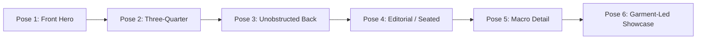
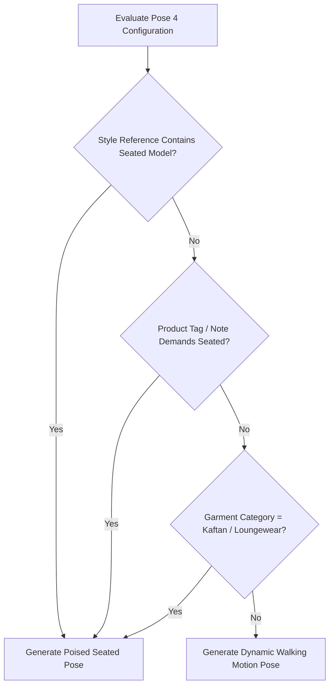

# Pose Planning & Six-Pose Catalog Plan

Every commercial e-commerce listing requires a balanced sequence of perspectives to give buyers confidence in fit, drape, back construction, and fabric texture. Youthnic AI Studio automates this via the **Six-Pose Catalog Plan**, and matches every pose to the garment category it detected.

---

## The Six-Pose Catalog Sequence

[SCREENSHOT REQUIRED:
Page: Studio (/studio)
Exact State: Six-Pose Catalog Plan strip displaying 6 configured pose cards with titles, prompt previews, and camera angles.
Exact UI Section: Six-Pose Catalog Plan configuration card.
Recommended Crop: 1200x380
Recommended Dimensions: 1200x380
Filename: studio-six-pose-plan-strip.webp]

<CardGroup cols={1}>
  <Card title="Pose 1: Front Hero Shot (Primary Listing Image)" icon="user">
    **Framing**: Full-length head-to-toe, centered composition, direct eye contact with camera.
     **Purpose**: Primary search result thumbnail. Displays the natural resting silhouette, hemline drop, balanced shoulder alignment, and overall proportions.
     **Posture**: Upright standing, hands relaxed naturally along hips or light thumb-tuck.
  </Card>

  <Card title="Pose 2: Three-Quarter Perspective (45° Angle)" icon="arrows-split-up-and-left">
    **Framing**: Full-length to mid-calf.
     **Purpose**: Shows side profile, garment depth, sleeve drape, trouser cut, and side slit flare.
     **Posture**: Model body rotated 45 degrees away from the lens, head turned gently back toward camera.
  </Card>

  <Card title="Pose 3: Unobstructed Rear Back View" icon="arrow-rotate-left">
    **Framing**: Full-length rear view.
     **Purpose**: Essential for showing back neckline cut, back yoke embroidery, zipper seams, and tasselled *latkan/dori* ties.
     **Drapery Rule (Critical)**: For ethnic wear with dupattas or stoles, Youthnic's prompt builder enforces an automated rule: the dupatta is neatly pinned or draped forward over the left shoulder, ensuring the back of the garment remains completely visible and unobstructed.
  </Card>

  <Card title="Pose 4: Creative Editorial (Conditional Seated Logic)" icon="couch">
    **Framing**: Medium-full environmental shot.
     **Purpose**: Conveys lifestyle aspirational appeal, fabric movement, or relaxed luxury lounging.
     **Conditional Logic**:
    - **Seated Pose**: If the product category demands it (e.g. relaxed loungewear, kaftans), if the uploaded **Style Reference** features a seated model, or if the user toggles *Seated Editorial*, the AI generates a poised seated pose on a minimalist sandstone plinth or carved wooden settee.
    - **Dynamic Motion**: Otherwise, the default is a fluid editorial mid-stride walking shot that captures fabric breeze and trailing hemline motion.
  </Card>

  <Card title="Pose 5: Intimate Detail Close-Up" icon="magnifying-glass">
    **Framing**: Tight torso/bust crop (collarbone to waist).
     **Purpose**: High-resolution focus on tactile elements—buttons, plackets, collar stitching, zardozi embroidery, gotapatti borders, and woven textile grain.
     **Focus**: Macro depth-of-field, soft background blur.
  </Card>

  <Card title="Pose 6: Garment-Led Showcase (Category Aware)" icon="shirt">
    **Framing**: Chosen by the garment family the analysis detected, so this frame always sells what the buyer actually judges.
     **Saree (Bengali or other traditional)**: a drape-led frame. The pallu/aanchal is placed exactly as the drape plan states, opened low and flat so its artwork, end treatment and border read; pleats stay flat and vertical, the hem border stays level. A Bengali saree additionally holds the upright, serene posture with the aanchal over its recorded shoulder.
     **Kurti / kurta set, lehenga, or any outfit with bottom wear**: a head-to-toe frame proving the top and the bottom wear are one coordinated set - top from shoulder seam to hem AND bottom wear from waistband to hem in a single frame, footwear grounded.
     **Short kurti, top, or western/casual**: a playful, natural, lively moment that plays against the backdrop this shoot already established - a light step, a turn, a relaxed lean, a genuine mid-laugh - with no new props invented.
     **Standalone long kurti, dress, or gown**: a full-length frame proving true fall, fit and length, hem level and complete in frame.
  </Card>
</CardGroup>

---

## Garment-Aware Pose Grammar

Body language is selected from the garment category, never from a generic ethnic-wear prior. The same locks on design, print, motif scale, colour, fit and construction apply in every frame - only pose, angle, framing and expression change.

| Detected family | Pose grammar applied to every frame |
| --- | --- |
| Bengali saree (tant, jamdani, garad, korial, baluchari, lal-paar, aatpoure drape) | Upright, serene posture; pallu/aanchal on its recorded shoulder with artwork and border readable; flat vertical pleats; continuous borders; hands clear of the pallu |
| Ethnic / traditional saree | Graceful, unhurried posture that never disturbs the drape; pallu follows the drape plan exactly and stays one continuous panel |
| Kurti / kurta set with bottom wear | Every frame proves fit, true length, sleeve shape and the complete set; dupatta kept off the yoke, placket, slit and bottom wear |
| Standalone long kurti | Fall, fit and hem length; never hitched, tucked or gathered |
| Short kurti / top | Playful, natural, lively movement that interacts with the established backdrop while the garment stays unobstructed |
| Lehenga | Choli, dupatta and the complete skirt flare with volume preserved |
| Dress / gown / western-casual | Relaxed current body language showing the complete silhouette, hem level and in frame |

---

## Bottom-Wear Presentation

**Output settings → Bottom wear** decides how the shoot treats a bottom garment. It is a presentation choice: the analysis still records exactly what the references prove.

| Setting | Behaviour |
| --- | --- |
| `Auto` (default) | Follows the analysis. Bottom wear recorded in the references gets full-body top + bottom framing; a SKU with no recorded bottom is treated as top-only. |
| `Outfit includes bottom wear` | Forces full-body top + bottom framing and the bottom-wear silhouette, colour and print locks, even when the analysis under-recorded the bottom. |
| `Top only` | The upper garment is the product. Coordinated or "matching" bottom wear is prohibited: the model wears one plain, neutral, unbranded bottom that never repeats the product's print, motif, embroidery, border, colour blocking or fabric, and is never presented as a second product piece. |

Automatic QA follows the same setting, so a top-only shoot is never failed for bottom-wear fidelity it was told not to render.

---

## The Pose 4 Conditional Seated Logic

Pose 4 contains built-in intelligence that dynamically determines whether the model should be seated or in motion:

### Forcing a Seated or Walking Pose

You can override the automatic decision at any time:
1. Click the **Edit Pose** pencil icon on Pose 4 card.
2. Under **Posture Type**, select between:
   - `Auto-Detect (Context Aware)`
   - `Force Seated (Sandstone Block / Settee)`
   - `Force Walking Motion (Mid-Stride Breeze)`
   - `Force Standing Poised (Contemporary Asymmetry)`

[SCREENSHOT REQUIRED:
Page: Studio (/studio)
Exact State: Pose 4 configuration modal open showing Posture Type selector with 'Force Seated' highlighted.
Exact UI Section: Pose configuration edit modal.
Recommended Crop: 550x450
Recommended Dimensions: 550x450
Filename: studio-pose-4-seated-toggle.webp]

---

## Disabling or Reordering Poses

Not every catalog requires all 6 poses:
- Toggle the switch on the top right of any pose card to **Enable/Disable** it. Disabled poses will not consume generation credits.
- Drag cards horizontally using the handle icon `::: ` to change the sequence order.

---

## Next Steps

- Proceed to [Generate Photoshoot](/studio/generate-photoshoot) to trigger rendering.
- Learn about [Quality Validation](/studio/quality-validation) scorecards.
