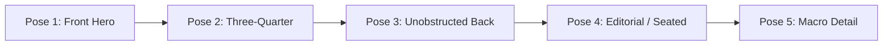
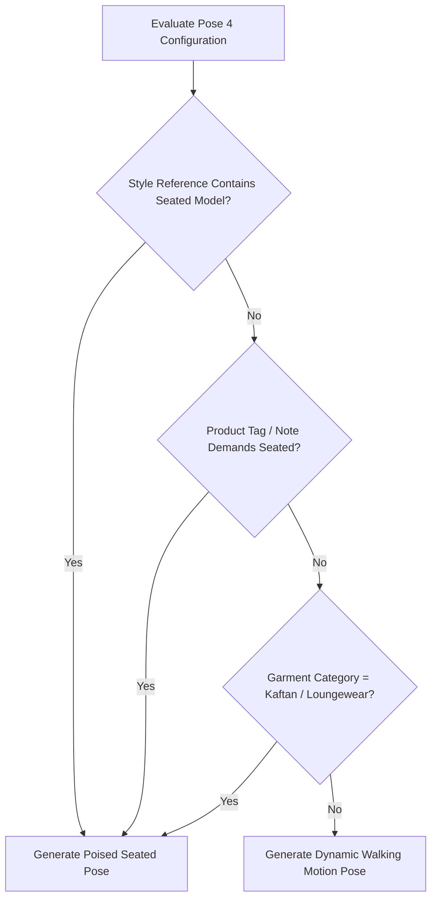

# Pose Planning & Five-Pose Catalog Plan

Every commercial e-commerce listing requires a balanced sequence of perspectives to give buyers confidence in fit, drape, back construction, and fabric texture. Youthnic AI Studio automates this via the **Five-Pose Catalog Plan**.

---

## The Five-Pose Catalog Sequence

[SCREENSHOT REQUIRED:
Page: Studio (/studio)
Exact State: Five-Pose Catalog Plan strip displaying 5 configured pose cards with titles, prompt previews, and camera angles.
Exact UI Section: Five-Pose Catalog Plan configuration card.
Recommended Crop: 1200x380
Recommended Dimensions: 1200x380
Filename: studio-five-pose-plan-strip.webp]

<CardGroup cols={1}>
  <Card title="Pose 1: Front Hero Shot (Primary Listing Image)" icon="user">
    **Framing**: Full-length head-to-toe, centered composition, direct eye contact with camera.
     **Purpose**: Primary search result thumbnail. Displays the natural resting silhouette, hemline drop, balanced shoulder alignment, and overall proportions.
     **Posture**: Upright standing, hands relaxed naturally along hips or light thumb-tuck.
  </Card>

  <Card title="Pose 2: Three-Quarter Perspective (45° Angle)" icon="arrows-split-up-and-left">
    **Framing**: Full-length to mid-calf.
     **Purpose**: Shows side profile, garment depth, sleeve drape, trouser cut, and side slit flare.
     **Posture**: Model body rotated 45 degrees away from the lens, head turned gently back toward camera.
  </Card>

  <Card title="Pose 3: Unobstructed Rear Back View" icon="arrow-rotate-left">
    **Framing**: Full-length rear view.
     **Purpose**: Essential for showing back neckline cut, back yoke embroidery, zipper seams, and tasselled *latkan/dori* ties.
     **Drapery Rule (Critical)**: For ethnic wear with dupattas or stoles, Youthnic's prompt builder enforces an automated rule: the dupatta is neatly pinned or draped forward over the left shoulder, ensuring the back of the garment remains completely visible and unobstructed.
  </Card>

  <Card title="Pose 4: Creative Editorial (Conditional Seated Logic)" icon="couch">
    **Framing**: Medium-full environmental shot.
     **Purpose**: Conveys lifestyle aspirational appeal, fabric movement, or relaxed luxury lounging.
     **Conditional Logic**:
    - **Seated Pose**: If the product category demands it (e.g. relaxed loungewear, kaftans), if the uploaded **Style Reference** features a seated model, or if the user toggles *Seated Editorial*, the AI generates a poised seated pose on a minimalist sandstone plinth or carved wooden settee.
    - **Dynamic Motion**: Otherwise, the default is a fluid editorial mid-stride walking shot that captures fabric breeze and trailing hemline motion.
  </Card>

  <Card title="Pose 5: Intimate Detail Close-Up" icon="magnifying-glass">
    **Framing**: Tight torso/bust crop (collarbone to waist).
     **Purpose**: High-resolution focus on tactile elements—buttons, plackets, collar stitching, zardozi embroidery, gotapatti borders, and woven textile grain.
     **Focus**: Macro depth-of-field, soft background blur.
  </Card>
</CardGroup>

---

## The Pose 4 Conditional Seated Logic

Pose 4 contains built-in intelligence that dynamically determines whether the model should be seated or in motion:

### Forcing a Seated or Walking Pose

You can override the automatic decision at any time:
1. Click the **Edit Pose** pencil icon on Pose 4 card.
2. Under **Posture Type**, select between:
   - `Auto-Detect (Context Aware)`
   - `Force Seated (Sandstone Block / Settee)`
   - `Force Walking Motion (Mid-Stride Breeze)`
   - `Force Standing Poised (Contemporary Asymmetry)`

[SCREENSHOT REQUIRED:
Page: Studio (/studio)
Exact State: Pose 4 configuration modal open showing Posture Type selector with 'Force Seated' highlighted.
Exact UI Section: Pose configuration edit modal.
Recommended Crop: 550x450
Recommended Dimensions: 550x450
Filename: studio-pose-4-seated-toggle.webp]

---

## Disabling or Reordering Poses

Not every catalog requires all 5 poses:
- Toggle the switch on the top right of any pose card to **Enable/Disable** it. Disabled poses will not consume generation credits.
- Drag cards horizontally using the handle icon `::: ` to change the sequence order.

---

## Next Steps

- Proceed to [Generate Photoshoot](/studio/generate-photoshoot) to trigger rendering.
- Learn about [Quality Validation](/studio/quality-validation) scorecards.
