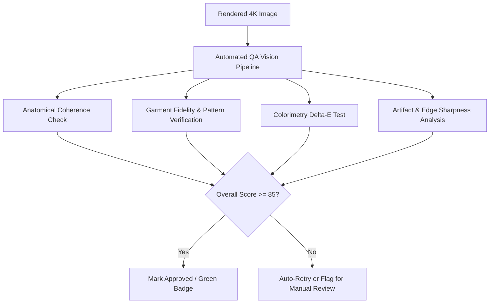

# Quality Validation

To ensure no defective images reach your product listings, Youthnic AI Studio features an automated multi-point **Quality Assurance (QA) Engine**. Every generated photo undergoes rigorous optical validation before being marked as completed.

---

## The Quality Scorecard

Hover over any completed image tile and click the **QA Badge** (e.g. `96/100`) to view the detailed breakdown:

[SCREENSHOT REQUIRED:
Page: Studio (/studio)
Exact State: QA scorecard popover open over Pose 1 showing individual radar/bar scores for Anatomy, Fidelity, Color, and Artifacts.
Exact UI Section: QA scorecard popover.
Recommended Crop: 420x480
Recommended Dimensions: 420x480
Filename: studio-qa-scorecard-popover.webp]

<AccordionGroup>
  <Accordion title="1. Anatomical Coherence (Weight: 30%)" icon="user-check">
    Evaluates human anatomy for natural poise and structural correctness:
    - **Hand & Finger Count**: Confirms exactly 5 fingers per hand, natural joint flexion, and realistic palm curvature.
    - **Facial Symmetry**: Evaluates iris alignment, natural eyelid crease, lip shape, and jawline definition.
    - **Limb Geometry**: Verifies natural elbow angles, knee articulation, and foot-to-ground anchoring.
  </Accordion>

  <Accordion title="2. Garment Fidelity & Pattern Matching (Weight: 35%)" icon="shirt">
    Compares the generated garment against the original uploaded reference photos:
    - **Neckline & Placket**: Checks neckline depth, collar sharpness, and button spacing.
    - **Embroidery Motif Preservation**: Verifies floral or geometric embroidery density, border alignment, and zari work.
    - **Silhouette Accuracy**: Ensures an A-line kurti was not rendered as a bodycon dress or loose kaftan.
  </Accordion>

  <Accordion title="3. Colorimetry & Delta-E Tolerance (Weight: 20%)" icon="palette">
    Calculates optical color deviation ($\Delta E$) between the reference fabric hex code and the generated garment under studio lighting.
    - $\Delta E < 3.0$: Imperceptible difference (Grade A+).
    - $\Delta E < 6.0$: Commercial acceptable variation under ambient lighting.
    - $\Delta E > 8.0$: Color shift triggered; flagged for automatic re-render.
  </Accordion>

  <Accordion title="4. Edge & Artifact Analysis (Weight: 15%)" icon="sparkles">
    Scans for edge fringing, halo artifacts around the model silhouette, texture smudging, or background distortion.
  </Accordion>
</AccordionGroup>

---

## Score Statuses & Thresholds

| Score Range | Status | Action Taken |
| :--- | :--- | :--- |
| **90 – 100** | Excellent | Automatically approved. Image is ready for instant download or marketplace export. |
| **80 – 89** | Good | Approved for catalog use with minor ambient lighting variation. |
| **70 – 79** | Needs Review | Flagged with an amber warning icon. Click to inspect before deciding to approve or regenerate. |
| **Below 70** | Defective | Automatically triggers a backend re-render with adjusted latent seeds (up to 2 automatic retries). If still below threshold, marked failed and credits are refunded. |

---

## Manual Quality Override

As a merchandiser or creative lead, you always have the final say:
- Click **Approve** to dismiss a "Needs Review" flag.
- Click **Reject & Regenerate** to re-render the pose with custom prompt feedback (e.g. *"Fix right hand finger alignment"*).

---

## Next Steps

- Learn how to re-render specific images in [Regenerate & Retry](/studio/regenerate-retry).
- Export completed assets in [Download Images](/studio/download-images).
