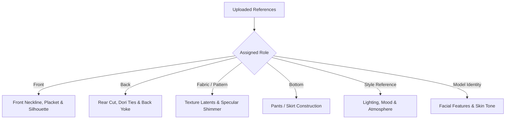

# Reference Roles

Assigning the correct **Reference Role** to each uploaded image tells the Youthnic AI conditioning pipeline exactly how to interpret and route that visual information. 

Rather than treating all images as a generic collage, Youthnic maps each role to a dedicated attention stream in the generative model.

---

## Standard Reference Roles

Click the role dropdown directly below any uploaded image thumbnail to choose from the standard roles:

[SCREENSHOT REQUIRED:
Page: Studio (/studio)
Exact State: Role selector dropdown opened below an uploaded image showing the list of standard roles with icons.
Exact UI Section: Image card role selector dropdown.
Recommended Crop: 360x420
Recommended Dimensions: 360x420
Filename: studio-reference-role-dropdown.webp]

| Role Key | UI Display Name | Primary Conditioning Purpose | Mandatory? |
| :--- | :--- | :--- | :--- |
| `front` | **Front Reference** | Primary guide for neckline cut, front placket buttons, chest yoke embroidery, and silhouette flare. | **Yes** (At least 1 required) |
| `back` | **Back Reference** | Defines back neck drop, zipper closures, tassel doris, and rear pattern placement. | Recommended |
| `fabric_pattern` | **Fabric / Pattern** | Locks thread count texture, woven jacquard patterns, digital prints, and fabric sheen into micro-detail attention. | Optional |
| `bottom` | **Bottom Garment** | Informs trousers, palazzos, cigarette pants, or lehenga skirt construction when shot separately from the top. | Optional (For separates) |
| `style_reference` | **Style / Mood Reference** | Informs background set architecture, lighting direction, color grading, and editorial posture without affecting garment details. | Optional |
| `model_identity` | **Model Face / Identity** | Locks a specific face and demographic persona into the generation across multiple photoshoot batches. | Optional |
| `mannequin` | **Mannequin Shot** | Signals the model removal pipeline to excise the hollow neck/mannequin form while retaining garment draping geometry. | Optional |
| `additional_product` | **Additional Detail** | Secondary angle shot (e.g. cuff detailing, sleeve tassels, pocket accents). | Optional |

---

## Understanding Style Reference vs. Garment Reference

<Warning>
**Critical Distinction**: A **Style Reference** is used strictly for ambient lighting, set architecture, and camera angles. It will **NEVER** alter your garment. Conversely, a **Front Reference** is strictly preserved as the garment itself.
</Warning>

- **Front / Back References**: The AI's highest priority is 100% geometric and textile preservation.
- **Style Reference**: The AI extracts color temperature (e.g. golden hour vs. overcast studio), architectural depth (e.g. neoclassical archways vs. concrete brutalism), and framing proximity.

---

## Specialized Indian Saree Reference Roles

When working with sarees, toggle the **Saree Mode** switch in the Studio header. Saree draping is multi-faceted, requiring specialized semantic roles to prevent pallu patterns from bleeding into pleats:

[SCREENSHOT REQUIRED:
Page: Studio (/studio)
Exact State: Saree Mode toggled on. The Product Photos panel displays specialized saree role slots with illustrations for Pallu, Pleats, and Blouse.
Exact UI Section: Saree Mode configuration panel.
Recommended Crop: 750x600
Recommended Dimensions: 750x600
Filename: studio-saree-mode-slots.webp]

<CardGroup cols={2}>
  <Card title="saree_pallu (Pallu Reference)" icon="scroll">
    Upload the decorative end piece (*aanchal* / *pallu*). The model will render this pattern draped across the shoulder and cascading down the arm or back.
  </Card>
  <Card title="saree_pleats (Pleats / Skirt Reference)" icon="bars-staggered">
    Upload the lower body pleat section. Ensures the vertical gathers display the correct pattern orientation and fall naturally to the floor.
  </Card>
  <Card title="saree_blouse (Blouse Piece)" icon="shirt">
    Upload the matching or contrasting blouse fabric, embroidery cuts, sleeve borders, or back latkan ties.
  </Card>
  <Card title="saree_border (Border / Zari Detail)" icon="gem">
    Macro shot of the running saree border (*zari*, *kaddi*, *gotapatti*). Locks continuous border alignment across all drape curves.
  </Card>
  <Card title="saree_body (Main Body Fabric)" icon="layer-group">
    Upload the repeating body field (e.g. butis, jaal weave, plain silk field, or tie-dye bandhani ground).
  </Card>
  <Card title="saree_full_flat (Full Unstitched Flat Lay)" icon="panorama">
    Full length flat shot showing the complete transition from body to pallu. Ideal for handloom and heritage weaves.
  </Card>
</CardGroup>

---

## Multiple Colourway References

If you are uploading multiple colourways for a single style, use the [Catalog Production](/catalog-production/overview) module rather than the single Studio photoshoot. The Catalog workflow allows you to assign shared model and style references while uploading unique front/back photos per colorway.

---

## Next Steps

- Learn about [SKU Details](/studio/sku-details) and commercial metadata tagging.
- Run [AI Product Analysis](/studio/ai-product-analysis) to inspect how the AI interprets your tagged references.
